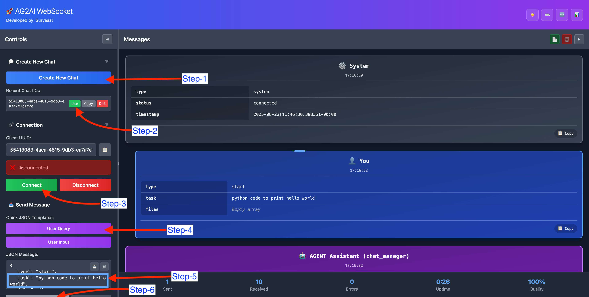

# 🧪 AG2AI WebSocket UI – Step-by-Step Usage Guide

This guide explains how to use the interactive WebSocket UI to send and receive agentic messages through a running AG2AI Autogen backend.

---

## 🖼️ Screenshot Reference



---

## 🚶‍♂️ Step-by-Step Instructions

### 1️⃣ Create a New Chat Session
Click on the **`Create New Chat`** button to generate a unique `chat_id`.  
This will be used to manage your session across messages.

---

### 2️⃣ Use the Chat ID
After creating a chat, click **`Use`** next to the desired `chat_id`.  
This tells the system which session you're actively working in.

---

### 3️⃣ Connect to WebSocket
Click the **`Connect`** button to establish a WebSocket connection with the backend server.  
Once connected, messages can be sent and received in real time.

---

### 4️⃣ Load a Query Template
Click **`User Query`** to auto-fill a JSON template into the input box.  
This template follows the format expected by the backend.

---

### 5️⃣ Enter Your Task
In the JSON input, fill in your prompt inside the `task` key.

#### Example:
```json
{
  "type": "start",
  "task": "Analyze a dataset and generate EDA visualizations",
  "files": []
}
````

---

### 6️⃣ Send the Message

Click **`Send`** to dispatch the message.
Wait for streaming agent responses to appear in the UI.

---

## 🧠 Optional: Respond to User Proxy Input Requests

If your setup includes a **User Proxy agent** (i.e., the agent needs user confirmation/input during the flow), you can respond using the `User Input` feature.

### When a prompt from the User Proxy appears:

1. Click **`User Input`** to load a template into the message input box.
2. Fill your response inside the `response` key.

#### Example:

```json
{
  "type": "input_response",
  "response": "Yes, proceed with the next step",
  "files": []
}
```

3. Click **`Send`** to reply to the ongoing agent conversation.

---

## ✅ Tips

* You can view each message block (sent/received) formatted with timestamps and roles.
* JSON inputs are auto-formatted for better readability.
* You can disconnect anytime using the **`Disconnect`** button.

---

## 🧪 Use Case Example

> Want to try a full agentic workflow?
> Try entering a task like:

```json
{
  "type": "start",
  "task": "Perform EDA on /path/to/titanic.csv dataset using Python",
  "files": []
}
```

and watch the agents plan, code, execute, debug, and summarize the task live.
