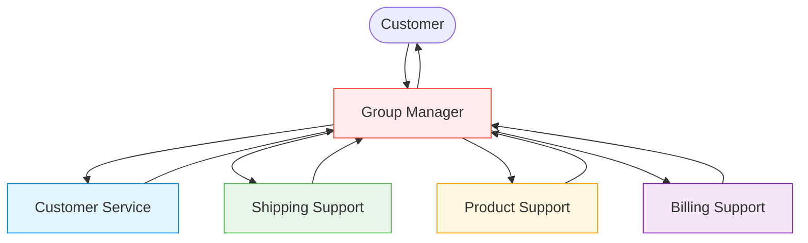

# AG2 v0.9 Release: Introducing the New Group Chat

## TL;DR
- AG2 <a href="https://pypi.org/project/ag2/0.9/" target="_blank">`v0.9`</a> unifies the previous Group Chat and Swarm into a single, powerful, new Group Chat
- This unification provides improved flexibility, control, and better foundations for scalability
- Features include pre-built orchestration patterns, enhanced workflow control, and robust context variables
- Includes all capabilities of the previous Group Chat and Swarm
- Swarm is now deprecated but still available. We recommend migrating to the new Group Chat pattern

\<!-- more -->

---

We're thrilled to announce the release of AG2 <a href="https://pypi.org/project/ag2/0.9/" target="_blank">`v0.9`</a>, featuring a significant enhancement to multi-agent orchestration. This release brings together our widely used Group Chat and Swarm pattern into a unified, more powerful Group Chat that combines the best aspects of both approaches.

## A New Era for Multi-Agent Orchestration

AG2 has always provided multiple ways to coordinate agents, from simple two-agent conversations to more complex multi-agent orchestration. With <a href="https://pypi.org/project/ag2/0.9/" target="_blank">`v0.9`</a>, we've completely reimagined agent orchestration by merging these approaches into a single, unified Group Chat architecture designed to be **extensible**, **controllable**, and **scalable**.

## Why We Made This Change

Before diving into the details, let's understand why this unification matters:

- **Simplified API** - One coherent way to orchestrate multi-agent workflows
- **Enhanced Flexibility** - Structured handoffs from Swarm with more diverse hand off targets
- **Improved State Management** - More robust context sharing and state tracking across agents
- **Future-proof Design** - A foundation that can grow with evolving multi-agent orchestration needs

## Key Features of the New Group Chat

### Pre-built Patterns for Different Needs

The new Group Chat implements several orchestration patterns to suit different use cases:

- **[AutoPattern](/docs/user-guide/advanced-concepts/orchestration/group-chat/patterns/#autopattern-llm-powered-speaker-selection)**: Uses an LLM to intelligently select the next speaker based on conversation context
- **[RoundRobinPattern](/docs/user-guide/advanced-concepts/orchestration/group-chat/patterns/#roundrobinpattern-sequential-speaker-rotation)**: Creates a sequential rotation where agents speak in a predefined order
- **[RandomPattern](/docs/user-guide/advanced-concepts/orchestration/group-chat/patterns/#randompattern-non-deterministic-speaker-selection)**: Randomly selects the next agent to speak (excluding the current speaker)
- **[ManualPattern](/docs/user-guide/advanced-concepts/orchestration/group-chat/patterns/#manualpattern-human-directed-speaker-selection)**: Puts humans in control by allowing manual selection of the next speaker
- **[DefaultPattern](/docs/user-guide/advanced-concepts/orchestration/group-chat/patterns/#defaultpattern-explicit-handoff-control)**: Provides complete control through explicitly defined handoffs

### Dynamic Workflow Control with Handoffs

The handoff system has been enhanced to provide powerful control over agent transitions:

- **[LLM-based conditions](/docs/user-guide/advanced-concepts/orchestration/group-chat/handoffs/#llm-based-conditions)**: Use the LLM to determine when to transfer control based on message content

```python
# Define LLM-based handoffs
customer_service.handoffs.add_llm_conditions([
    OnCondition(
        target=AgentTarget(billing_specialist),
        condition=StringLLMCondition(prompt="When the query is about billing or payments."),
    )
])
```

- **[Context-based conditions](/docs/user-guide/advanced-concepts/orchestration/group-chat/handoffs/#context-based-conditions)**: Use shared context variables to make transition decisions

```python
# Define context-based handoffs
# This will route to the escalation agent when the issue priority is high
support_agent.handoffs.add_context_condition(
    OnContextCondition(
        target=AgentTarget(agent=escalation_agent),
        condition=ExpressionContextCondition(
            expression=ContextExpression("${issue_priority} == 'high'")
        )
    )
)

# This will route to a supervisor when retry count exceeds 3
support_agent.handoffs.add_context_condition(
    OnContextCondition(
        target=AgentTarget(agent=supervisor_agent),
        condition=ExpressionContextCondition(
            expression=ContextExpression("${retry_count} > 3")
        )
    )
)
```

- **[After-work behavior](/docs/user-guide/advanced-concepts/orchestration/group-chat/handoffs/#after-work-behavior)**: Define default behavior for when an agent completes its work

```python
# Define what happens after an agent completes its work
billing_specialist.handoffs.set_after_work(RevertToUserTarget())
```

### Enhanced Transition Targets

The new Group Chat pattern introduces powerful "[Transition Targets](/docs/user-guide/advanced-concepts/orchestration/group-chat/handoffs/#transition-targets)" - which define where control should go after an agent completes its work. This system goes beyond simply transferring to another agent:

- **AgentTarget/AgentNameTarget**: Transfer to a specific agent directly or by name
- **RevertToUserTarget**: Return control to the human user
- **TerminateTarget**: End the conversation entirely
- **StayTarget**: Keep control with the current agent
- **RandomAgentTarget**: Randomly select from a list of possible agents
- **AskUserTarget**: You decide who the next agent is
- **NestedChatTarget**: Transfer to a nested conversation
- **GroupChatTarget**: Transfer to a new group chat (nested group chats!)
- **GroupManagerTarget**: Transfer to the group chat manager who will select the next speaker

This flexible targeting system enables complex workflows where control might need to move between different levels of conversation or to specialized processes.

### Shared Context Management

The new `ContextVariables` class provides a structured way to share and maintain state across agents. This shared memory enables agents to:

- Maintain consistent information throughout a conversation
- Make decisions based on the current state
- Pass structured data between agents
- Control workflow based on context values

Here's how you can create and use context variables:

```python
# Initialize context variables
context = ContextVariables(data={
    "customer_id": "C12345",
    "subscription_tier": "premium",
    "support_history": []
})

# Update context in a tool function
def log_customer_interaction(
    issue_type: str,
    resolution: str,
    context_variables: ContextVariables
) -> ReplyResult:
    """Log a customer interaction in the context."""

    # Add this interaction to history
    support_history = context_variables.get("support_history", [])
    support_history.append({
        "timestamp": datetime.now().isoformat(),
        "issue_type": issue_type,
        "resolution": resolution
    })

    context_variables["support_history"] = support_history
    context_variables["last_issue_type"] = issue_type

    return ReplyResult(
        message="Interaction logged successfully",
        context_variables=context_variables
    )
```

## Getting Started with the New Group Chat

Let's explore a practical example of how the new Group Chat pattern can transform customer service workflows. We'll implement an e-commerce customer support system where different departments work together seamlessly to assist customers.

### The Use Case

In this scenario, we want to create a customer support system that:

1. Greets customers and identifies their issue type
2. Routes queries to the appropriate department (shipping, product, or billing)
3. Maintains customer context throughout the conversation
4. Provides personalized assistance based on purchase history

### The Workflow

Here's how our multi-department customer service system will function when using the AutoPattern:



When using the [AutoPattern](/docs/user-guide/advanced-concepts/orchestration/group-chat/patterns/#autopattern-llm-powered-speaker-selection), the Group Manager orchestrates all interactions. It receives the customer's query, selects the appropriate agent to respond, and then decides where to route the conversation next based on the context. All communication flows through the Group Manager, which intelligently determines which specialized department should handle each part of the conversation.

### Implementing the workflow with the new GroupChat

Now, let's implement this system:

```python
from typing import Annotated
from autogen import ConversableAgent, LLMConfig
from autogen.agentchat import initiate_group_chat
from autogen.agentchat.group.patterns import AutoPattern
from autogen.agentchat.group import ReplyResult, AgentNameTarget, ContextVariables, RevertToUserTarget

# Initialize context with customer information
customer_context = ContextVariables(data={
    "customer_name": "Jordan Smith",
    "account_status": "active",
    "purchase_history": ["wireless headphones", "smartphone case"]
})

# Define a function for shipping support to respond with customer context
def provide_shipping_response(
    response: Annotated[str, "The shipping response to provide"],
    context_variables: ContextVariables
) -> ReplyResult:
    """Provide a personalized shipping response using customer context."""

    # Access customer information from context
    customer_name = context_variables.get("customer_name", "valued customer")
    purchase_history = context_variables.get("purchase_history", [])

    # Check if the current query is about a product in purchase history
    current_query = context_variables.get("current_query", "")
    relevant_purchases = [item for item in purchase_history if item.lower() in current_query.lower()]

    # Create a personalized greeting
    personalized_greeting = f"Hello {customer_name}! "

    # Add context about their purchase if relevant
    if relevant_purchases:
        purchased_item = relevant_purchases[0]
        personalized_greeting += f"I see you've purchased {purchased_item} from us. "

    # Combine the personalized greeting with the actual response
    full_response = personalized_greeting + response

    # Return control to the user after providing support
    return ReplyResult(
        message=full_response,
        target=RevertToUserTarget(),
        context_variables=context_variables
    )

# Configure LLM
llm_config = LLMConfig(api_type="openai", model="gpt-4o-mini")

# Create specialized agents
with llm_config:
    customer_service = ConversableAgent(
        name="customer_service",
        system_message="You're the initial contact for all customer inquiries. Direct shipping questions to shipping_support, product questions to product_support, and billing issues to billing_support."
    )

    shipping_support = ConversableAgent(
        name="shipping_support",
        system_message="""You handle all shipping-related queries, including delivery times, tracking, and shipping methods.
        Always use the provide_shipping_response tool to respond, which will add personalized greetings based including customer name. So you don't need to greet the customer.""",
        functions=[provide_shipping_response]
    )

    product_support = ConversableAgent(
        name="product_support",
        system_message="You provide detailed information about products, specifications, compatibility, and usage instructions."
    )

    billing_support = ConversableAgent(
        name="billing_support",
        system_message="You handle payment issues, refunds, subscription questions, and billing disputes."
    )

# Create user agent
user = ConversableAgent(name="user", human_input_mode="ALWAYS")

# Create pattern for orchestration
pattern = AutoPattern(
    initial_agent=customer_service,
    agents=[customer_service, shipping_support, product_support, billing_support],
    user_agent=user,
    context_variables=customer_context,
    group_manager_args={"llm_config": llm_config}
)

# Start the group chat
result, final_context, last_agent = initiate_group_chat(
    pattern=pattern,
    messages="I ordered wireless headphones last week but haven't received any shipping confirmation yet. Can you help?",
    max_rounds=10
)
```

This example demonstrates a critical aspect of the new Group Chat pattern: **using tool functions to work with context variables**.

!!! note

    1. Context variables are not directly accessible to the LLM
    2. To read or update context variables, agents must use tool functions
    3. Tool functions receive the context variables as a parameter (via dependency injection) and can return updated context in the ReplyResult

In this example, the `customer_service` agent analysis the query and route to the `shipping_support` agent, which inturn uses the `provide_shipping_response` tool to access customer information for personalized responses.

### Running This Example

To run this example yourself:

1. **Save the code** to a file (e.g., `customer_service_demo.py`)

2. **Set up your OpenAI API key** - This example uses the `gpt-4o-mini` model from OpenAI:

    === "macOS / Linux"

        ```bash
        export OPENAI_API_KEY=<your_api_key_here>
        ```

    === "Windows"

        ```bash
        set OPENAI_API_KEY=<your_api_key_here>
        ```

3. **Install the required packages**:
   ```bash
   pip install ag2[openai]
   ```

4. **Run the script**:
   ```bash
   python customer_service_demo.py
   ```

    !!! note
        This example uses OpenAI's `gpt-4o-mini` model. If you want to use a different provider, ensure you:

            - Install the appropriate AG2 extra (e.g., `pip install ag2[anthropic]` for Claude models)
            - Update the `LLMConfig` to use your preferred provider and model
            - Set the appropriate environment variables for authentication with your chosen provider

        You can find the supported model provides [here](/docs/user-guide/models/amazon-bedrock)

### Example Output

When you run the above code, you should see output similar to this:

```console
user (to chat_manager):

I ordered wireless headphones last week but haven't received any shipping confirmation yet. Can you help?

--------------------------------------------------------------------------------

Next speaker: customer_service


>>>>>>>> USING AUTO REPLY...
customer_service (to chat_manager):

Please reach out to our shipping support team for assistance with your shipping confirmation. They will be able to provide you with the information you need.

--------------------------------------------------------------------------------

Next speaker: shipping_support


>>>>>>>> USING AUTO REPLY...
shipping_support (to chat_manager):

***** Suggested tool call (call_LTqrXWsFZM60g72gzxOpLEJ6): provide_shipping_response *****
Arguments:
{"response":"It appears that you have not yet received a shipping confirmation for your wireless headphones. I recommend checking your email, including your spam or junk folders, as shipping confirmations can sometimes be misdirected. If you still don't see it, please provide me with your order details, and I can assist you further."}
******************************************************************************************

--------------------------------------------------------------------------------

Next speaker: _Group_Tool_Executor


>>>>>>>> EXECUTING FUNCTION provide_shipping_response...
Call ID: call_LTqrXWsFZM60g72gzxOpLEJ6
Input arguments: {'response': "It appears that you have not yet received a shipping confirmation for your wireless headphones. I recommend checking your email, including your spam or junk folders, as shipping confirmations can sometimes be misdirected. If you still don't see it, please provide me with your order details, and I can assist you further."}
_Group_Tool_Executor (to chat_manager):

***** Response from calling tool (call_LTqrXWsFZM60g72gzxOpLEJ6) *****
Hello Jordan Smith! It appears that you have not yet received a shipping confirmation for your wireless headphones. I recommend checking your email, including your spam or junk folders, as shipping confirmations can sometimes be misdirected. If you still don't see it, please provide me with your order details, and I can assist you further.
**********************************************************************

--------------------------------------------------------------------------------

Next speaker: user

Replying as user. Provide feedback to chat_manager. Press enter to skip and use auto-reply, or type 'exit' to end the conversation: exit

>>>>>>>> TERMINATING RUN (7f492d62-e29f-43e2-a6a4-c93288d5848f): User requested to end the conversation

>>>>>>>> TERMINATING RUN (da384b96-1ca2-492f-a035-80c8b9b84c4a): No reply generated
```

## Migrating from Swarm to the New Group Chat

If you're currently using Swarm, we strongly recommend migrating to the new Group Chat pattern. While Swarm functionality is still available in <a href="https://pypi.org/project/ag2/0.9/" target="_blank">`v0.9`</a>, it's now deprecated and will be removed in a future release.

At a high level, the migration process involves:

1. **Updating imports** to use the new group chat modules instead of swarm modules
2. **Converting context variables** from dictionary-based to the new `ContextVariables` class
3. **Replacing SwarmResult with ReplyResult** in your agent functions
4. **Updating handoff definitions** to use the new agent-based handoff system
5. **Using patterns** to configure and initiate group chats

For detailed migration instructions and examples, please refer to our [Migration Guide](/docs/user-guide/advanced-concepts/orchestration/swarm/deprecation).


## Towards Scalable Agent Orchestration

This unified framework represents the first step toward more scalable agent orchestration. While we have not yet fully achieved scalability, this new architecture lays the necessary foundation with its modular design and consistent interfaces. The new Group Chat pattern provides a path forward for better support for distributed systems and persistence.

## Other Improvements in v0.9

Beyond the new Group Chat pattern, v0.9 includes several other enhancements:

- **Google Drive Toolkit Improvements**: Added the ability to download to a specific subfolder
- **Documentation Updates**: Comprehensive updates to reflect the new architecture
- **Bug Fixes**: Various fixes and improvements throughout the codebase

## Get Started Today!

The new Group Chat pattern is available now in AG2 v0.9. We encourage all users to explore it, especially those currently using Swarm functionality.

To learn more, check out our documentation:

- [Group Chat Overview](/docs/user-guide/advanced-concepts/orchestration/orchestrations)
- [Swarm Migration Guide](/docs/user-guide/advanced-concepts/orchestration/swarm/deprecation)

We're excited to see what you build with this powerful new framework!
