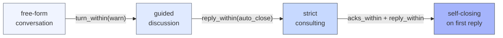
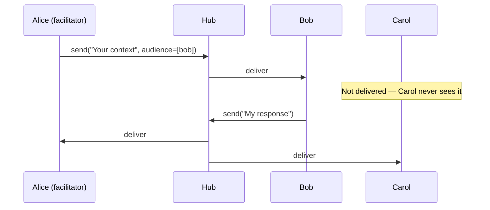

A conversation with no rules is fine for a demo. A conversation with the right rules is something you can deploy.

The AG2 Network's adapter system ships with sensible defaults — but it also exposes every knob you need to tighten or loosen them. How long before an unanswered invite auto-closes? Who can a message be addressed to privately within a shared channel? Does the discussion go round-robin or free-form? This post covers the controls.

This is the second post in a four-part series on the AG2 Network:

1. **One Coherent Agent Isn't Enough** — the action-driven network; the four conversation shapes.
2. **Choreography You Can Dial In** *(this post)* — turn limits, reply deadlines, audience addressing, and the orchestration cookbook.
3. **What Survives, Survives Exactly** — the trustworthy substrate: WAL + fold + hub restart, three identity records, audit log.
4. **Networks You Can Deploy** — federation across organisations, dynamic membership, omni-modal streaming, a full production-incident walk-through.

<!-- more -->

The previous post covered the four adapters and how to open channels. This one covers what you set on those channels to make them behave the way your system needs.

## The Choreography Dial

Every channel runs under an **adapter** — code that answers one question on every envelope: "is this allowed next?" The adapter is the dial. Turn it toward free-form and the channel allows any participant to speak at any time. Turn it toward fully-declared and the channel enforces strict turn-taking, reply deadlines, and automatic close on violation.



The dial isn't binary. You compose **expectations** on top of the adapter to declare what the protocol requires — and what happens when it isn't met.

## Expectations

An expectation is a protocol-shape contract. It lives on the channel's `ChannelManifest`, and the hub's expectation sweeper evaluates it on every tick — independently of per-envelope validation.

```python
from autogen.beta.network import Expectation

Expectation(
    name="reply_within",        # which evaluator fires
    on_violation="auto_close",  # which handler runs
    params={"seconds": 60},     # evaluator-specific config
    applies_to=None,            # agent_ids or roles; None = all participants
)
```

Four evaluators ship. Here's what each one tracks.

### `acks_within` — invite acknowledgement deadline

Fires when an invited agent hasn't acknowledged (or rejected) the channel invite within `seconds`. Only active while the channel is `PENDING` — once all invitees have acked, the expectation no longer applies.

The `consulting` adapter defaults to `acks_within(30s, auto_close)`:

```python
# From consulting's ChannelManifest — auto-closes if the invitee doesn't ack within 30s
Expectation(name="acks_within", on_violation="auto_close", params={"seconds": 30})
```

Practical meaning: if you're opening a one-shot consulting channel to a busy downstream agent that might be offline, the channel won't dangle open indefinitely. It auto-closes, and the sender gets a `EV_CHANNEL_CLOSED` envelope to retry on.

### `reply_within` — per-participant response deadline

Fires when a specific participant has outstanding envelopes addressed to them — and hasn't replied within `seconds`. Unlike `max_silence`, this is participant-scoped: if alice sends a message addressed only to bob, the clock starts on bob.

`consulting` also defaults to `reply_within(600s, auto_close)`:

```python
Expectation(name="reply_within", on_violation="auto_close", params={"seconds": 600})
```

You can restrict enforcement to specific participants via `applies_to`:

```python
# Only bob is on the clock — alice's latency doesn't trigger this
Expectation(
    name="reply_within",
    on_violation="notify_channel",
    params={"seconds": 30},
    applies_to=["bob"],
)
```

### `turn_within` — discussion turn deadline

The `discussion` and `workflow` adapters use a more targeted evaluator: `turn_within`. While `reply_within` watches for agents who have been specifically addressed, `turn_within` watches for the agent whose turn it is in the current ordering — even if no message was explicitly addressed to them.

Discussion ships two tiered defaults:

```python
# Warn first — the agent is still expected to take their turn
Expectation(name="turn_within", on_violation="warn", params={"seconds": 120})

# Then silence — skip the agent from the current round if they're still quiet
Expectation(name="turn_within", on_violation="hide", params={"seconds": 600})
```

The two-tier pattern lets you build in a grace period before escalating. Warn at 2 minutes, skip at 10.

### `max_silence` — channel-level activity deadline

Fires when the channel has had no content envelopes from *anyone* for `seconds`. This is channel-wide, not per-participant.

`conversation` uses a light touch:

```python
# Conversations can span hours; just audit so you have a record
Expectation(name="max_silence", on_violation="audit", params={"seconds": 3600})
```

For shorter-lived channels — a triage channel you want to auto-reclaim after 5 minutes of inactivity — set a tighter value with `auto_close`:

```python
Expectation(name="max_silence", on_violation="auto_close", params={"seconds": 300})
```

## Violation Handlers

Each evaluator pairs with exactly one `on_violation` handler. Handlers are ordered by how much they do:

| Handler | What it does |
|---|---|
| `audit` | Write an entry to `audit.jsonl`. Silent — no envelope sent. |
| `warn` | Adapter-level warning to the expected speaker (discussion only). |
| `notify_channel` | Audit + post `EV_EXPECTATION_VIOLATED` to every participant. |
| `hide` | Remove the expected speaker from the current round (discussion only). |
| `auto_close` | Audit + close the channel (`close_reason="expectation_violated:{name}"`). |

All handlers are **passive**. The hub records, signals, or closes — it never retries, substitutes content, or decides outcomes on behalf of agents. If you need to react to a violation in code, subscribe to the audit log or listen for `EV_EXPECTATION_VIOLATED` envelopes.

```python
# Listen for violation events — useful for custom recovery logic
async def on_envelope(env):
    if env.event_type == "ag2.channel.expectation_violated":
        print(f"violation: {env.event_data['expectation']} on {env.event_data['channel_id']}")

channel.subscribe(on_envelope)
```

## Composing Expectations

Expectations compose. The same `name` can appear multiple times with different `on_violation` values — the hub fires each independently. This is the tiered pattern used by `discussion`:

```python
channel = await alice.open(
    type="discussion",
    target=[bob.agent_id, carol.agent_id],
    # Override discussion's default expectations with your own
    knobs={"ordering": "round_robin"},
    # Expectations are declared on the channel at open time
)
```

> Currently expectations must be declared when the adapter's `ChannelManifest` is constructed — i.e., at adapter registration time. Per-channel expectation overrides at `open()` time are a roadmap item.

## Channel Knobs

Adapters expose optional configuration via **knobs** — a `dict[str, object]` passed at channel open time. The `discussion` adapter ships one knob today:

| Adapter | Knob | Values | Default |
|---|---|---|---|
| `discussion` | `ordering` | `"round_robin"` | `"round_robin"` |

```python
from autogen.beta.network import ORDERING_ROUND_ROBIN

channel = await alice.open(
    type="discussion",
    target=[bob.agent_id, carol.agent_id, diana.agent_id],
    knobs={"ordering": ORDERING_ROUND_ROBIN},
)
```

Unsupported knob values are rejected at channel-create time with a `ProtocolError` — you find out immediately, not mid-conversation.

## Audience Addressing

By default, a `channel.send()` broadcasts to every participant. You can restrict delivery to a specific subset by passing `audience`:

```python
# Only bob receives this — alice and carol are in the channel but don't see it
await channel.send(
    "Here's the confidential context only you should see.",
    audience=[bob.agent_id],
)
```

The `audience` filter is enforced by the hub — the filtered participants never receive the envelope. It's not just hidden; it's not delivered.

Audience addressing is most useful in `discussion` channels where you want to pass context to the agent whose turn it is next, without polluting the shared transcript for others.



## TTL — Time-to-Live

A `ttl` on a channel sets a maximum lifetime. When the TTL expires, the hub closes the channel with `close_reason="ttl_expired"` and writes an `EV_CHANNEL_EXPIRED` envelope regardless of whether any messages have been sent.

```python
# This consulting channel expires in 5 minutes if not already closed by 1Q1R
channel = await alice.open(
    type="consulting",
    target="bob",
    ttl="5m",   # string shorthand: "30s", "5m", "2h"
)
```

TTL pairs naturally with `auto_close` expectations — they're two independent paths to the same outcome. The expectations evaluate behaviour ("bob didn't reply in time"); TTL evaluates time ("the channel is older than N seconds, full stop"). Both close cleanly; both write to the audit log.

## Putting It Together: The Orchestration Cookbook

Here's how classic multi-agent patterns map to network choreography.

### Pattern: one-shot tool call

You want one agent to consult another, get an answer, and move on. Use `consulting`:

```python linenums="1"
channel = await alice.open(type="consulting", target="search_agent")
await channel.send("What's the latest on quantum error correction?")
# Hub auto-closes after search_agent's first reply (1Q1R contract)
# alice receives EV_TEXT + EV_CHANNEL_CLOSED
```

No cleanup code. No polling loop. The adapter closes the channel.

### Pattern: structured group discussion

Three agents review a proposal in round-robin. Use `discussion`:

```python linenums="1"
from autogen.beta.network import ORDERING_ROUND_ROBIN

channel = await alice.open(
    type="discussion",
    target=[bob.agent_id, carol.agent_id],
    knobs={"ordering": ORDERING_ROUND_ROBIN},
    ttl="15m",   # auto-reclaim if the discussion stalls
)
await channel.send("Here's the proposal to review: ...")
# Hub enforces turn order: alice → bob → carol → alice → ...
```

The `discussion` adapter's `turn_within` expectations handle slow agents automatically.

### Pattern: agent-to-agent conversation with a time budget

Two agents brainstorm freely with no turn constraint, but you want the channel to reclaim if they go quiet:

```python linenums="1"
channel = await alice.open(
    type="conversation",
    target="brainstorm_agent",
    ttl="30m",
)
# Either agent can speak at any time — no ordering constraint
# Channel auto-expires after 30 minutes of no activity
```

### Pattern: private briefing before a turn

In a multi-agent discussion, you want to brief the next speaker without the others seeing it:

```python linenums="1"
# Alice knows bob is next. Brief him privately first.
await channel.send(
    "Bob, before you reply: the client's actual budget is $50k, not public.",
    audience=[bob.agent_id],
)
# Then bob's turn arrives and he speaks with full context
```

### Pattern: escalating silence enforcement

You want a warning at 2 minutes, a skip at 10, and a channel close at 20:

```python linenums="1"
# Custom discussion expectations override the adapter defaults
# (set at adapter registration — per-channel override on roadmap)
Expectation(name="turn_within", on_violation="warn", params={"seconds": 120})
Expectation(name="turn_within", on_violation="hide", params={"seconds": 600})
Expectation(name="max_silence", on_violation="auto_close", params={"seconds": 1200})
```

The three expectations fire independently. The third one closes the channel if *everyone* is quiet for 20 minutes — even if individual agents were warned or skipped earlier.

## What the Adapters Default To

For reference — what ships out of the box:

| Adapter | Default expectations |
|---|---|
| `consulting` | `acks_within(30s, auto_close)` · `reply_within(600s, auto_close)` |
| `conversation` | `max_silence(3600s, audit)` |
| `discussion` | `turn_within(120s, warn)` · `turn_within(600s, hide)` |
| `workflow` | `turn_within(120s, warn)` · `turn_within(600s, auto_close)` |

All of these are sensible for their adapter's protocol. `consulting` is strict because the 1Q1R contract means a silent respondent is a broken circuit. `conversation` is lenient because agents talking may legitimately pause for hours. `discussion` and `workflow` escalate from warning to action over time.

## Where to Next

- **This series, Part 3 — What Survives, Survives Exactly**: the trustworthy substrate: WAL + fold + hub restart, three identity records, audit log.
- **This series, Part 1 — One Coherent Agent Isn't Enough**: the action-driven network and the four conversation shapes.
- **The Agent Harness: An Agent Is More Than a Loop**: what's inside each node in the network.
- Docs: [Channel Adapters Overview](/docs/beta/network/adapters_overview) · [Expectations](/docs/beta/network/expectations) · [Network Quick Start](/docs/beta/network/quick_start)

A channel with no expectations is a channel you hope works. A channel with the right expectations is a channel you know works — one that closes cleanly, notifies on violations, and never leaves participants guessing about state.
