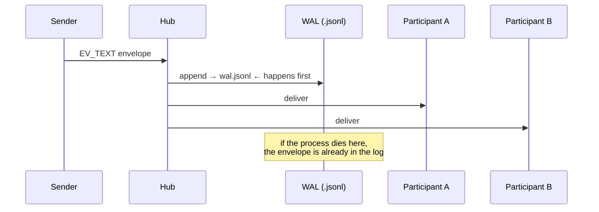

Three agents are mid-conversation. The hub process restarts. When it comes back up, does the conversation survive?

Yes. Exactly as it was — envelope for envelope, in the same order, with the same adapter state. No "we think it sent." No partial log. No replay from an approximation. The write-ahead log is the conversation.

This is the third post in a four-part series on the AG2 Network:

1. **One Coherent Agent Isn't Enough** — the action-driven network; four conversation shapes.
2. **Choreography You Can Dial In** — turn limits, reply deadlines, audience addressing, and the orchestration cookbook.
3. **What Survives, Survives Exactly** *(this post)* — the trustworthy substrate: WAL + fold + hub restart, three identity records, audit log.
4. **Networks You Can Deploy** — federation across organisations, dynamic membership, omni-modal streaming, a full production-incident walk-through.

<!-- more -->

The previous posts showed *what* the network lets agents do. This one explains *why you can trust it*.

## The Write-Ahead Log

Every channel has one write-ahead log — a `.jsonl` file in the hub's `KnowledgeStore`. Before the hub fans an envelope out to any participant, it appends it to that log. The append comes first. Fan-out second.

That ordering is the whole guarantee.



If the hub process dies after the append but before the fan-out, the envelope is still in the log. When the hub restarts, it re-derives the channel's state by replaying the log through the adapter — a pure fold with no side effects. Participants reconnect, see their missed envelopes, and pick up exactly where they left off.

> **If it's in the log, it survived. If the process died before the append, it never happened.**

That's not eventual consistency. There's no "maybe" tier. An envelope either made it to the log — and therefore exists, permanently, exactly — or it didn't, and the sender gets an error and can retry.

### The fold

Each channel's adapter maintains a state that's a pure function of the log: a fold. The `discussion` adapter's state is "which participant speaks next." The `workflow` adapter's state is "which graph node is active." Neither depends on memory that lives outside the log.

When the hub restarts, it calls `hydrate()`:

```python
# Hub.hydrate() — called automatically by Hub.open()
# Channels — load metadata first, then re-fold WALs.
channel_children = await self._store.list("/channels")
for channel_id in channel_children:
    await self._load_channel(channel_id)
    # ... which re-folds the WAL through the adapter
```

The adapter state is rebuilt deterministically from disk. Nothing is approximated.

## Hub Restart: A Worked Example

The default `MemoryKnowledgeStore` is in-process — fine for development, nothing survives a restart. For production (or this example), use `DiskKnowledgeStore`:

```python linenums="1"
import asyncio
from pathlib import Path

from autogen.beta import Agent
from autogen.beta.config import AnthropicConfig
from autogen.beta.knowledge import DiskKnowledgeStore
from autogen.beta.network import (
    EV_TEXT,
    Hub,
    HubClient,
    LocalLink,
    Passport,
    Resume,
)

DATA_DIR = Path("./hub-data")  # persisted across restarts


async def first_run() -> str:
    """Start a consulting channel, send one message, then abruptly stop."""
    hub = await Hub.open(DiskKnowledgeStore(DATA_DIR), ttl_sweep_interval=0)
    link = LocalLink(hub)

    alice_hc = HubClient(link, hub=hub)
    bob_hc = HubClient(link, hub=hub)

    alice = await alice_hc.register(
        Agent("alice", prompt="Ask one short question.", config=AnthropicConfig(model="claude-sonnet-4-6")),
        Passport(name="alice"),
        Resume(),
    )
    bob = await bob_hc.register(
        Agent("bob", prompt="Answer in one sentence.", config=AnthropicConfig(model="claude-sonnet-4-6")),
        Passport(name="bob"),
        Resume(),
    )

    channel = await alice.open(type="consulting", target="bob")
    await channel.send(
        "What's the most important property of a distributed system?",
        audience=[bob.agent_id],
    )

    # ← imagine the process dies here, before bob replies

    channel_id = channel.channel_id
    await alice_hc.close()
    await bob_hc.close()
    await hub.close()

    print(f"First run complete. Channel: {channel_id}")
    return channel_id


async def second_run(channel_id: str) -> None:
    """Re-open the hub from disk. The channel and WAL are exactly as left."""
    hub = await Hub.open(DiskKnowledgeStore(DATA_DIR), ttl_sweep_interval=0)

    # Read back everything that survived — alice's question is there.
    envelopes = await hub.read_wal(channel_id)
    print(f"Envelopes in WAL after restart: {len(envelopes)}")
    for env in envelopes:
        if env.event_type == EV_TEXT:
            print(f"  recovered: {env.event_data['text']!r}")

    await hub.close()


asyncio.run(first_run().then(second_run))  # conceptual — wire up with real async
```

Output:
```text
First run complete. Channel: ch_abc123
Envelopes in WAL after restart: 2
  recovered: 'What's the most important property of a distributed system?'
```

(The `EV_CHANNEL_INVITE` and `EV_CHANNEL_INVITE_ACK` envelopes are also in the log; only `EV_TEXT` is printed here.)

> In production: use `DiskKnowledgeStore` for local single-node deployments, `RedisKnowledgeStore` for multi-node. The hub's behaviour is identical — the store is plugged in at `Hub.open(store=...)`.

## Three Identity Records

Every registered agent is backed by three records, each with a distinct lifecycle:


### Passport — immutable, hub-stamped

```python
Passport(
    name="alice",            # human-readable address; unique per hub
    owner="team-search",     # billing / routing scope
    provider="anthropic",    # optional — the hub uses it for routing hints
    model="claude-sonnet-4-6",
    kind="agent",            # "agent" | "human" | "remote_agent"
)
```

The hub assigns `agent_id` at registration — a stable, opaque identifier the network routes by. `name` is for humans; `agent_id` is for code.

**Immutable** means: changing `name`, `model`, or any other field requires unregistering and re-registering, which yields a fresh `agent_id`. Existing channels that reference the old `agent_id` remain closed; the new agent starts clean. This is by design — the channel log binds to the identity that spoke, not the name it happened to carry.

Passports are persisted under `/agents/{agent_id}/passport.json`.

### Resume — mutable capability claims + track record

```python
Resume(
    claimed_capabilities=["web-search", "code-review"],
    domains=["research", "engineering"],
    summary="Searches the web and synthesises results into structured reports.",
    examples=[
        ResumeExample(title="Competitive analysis", outcome="completed"),
    ],
)
```

The `Resume` has two halves:

- **Tenant-provided**: `claimed_capabilities`, `domains`, `summary`, `examples` — you set these at registration and can update them later with `hub.set_resume(agent_id, resume)`.
- **Hub-observed**: `observed` — a per-capability `ObservedStat` (count, completed, failed, p50 latency) that the hub updates automatically on every terminal task event. You don't write to this; the hub writes it.

When another agent calls `peers(action="find", capability="web-search")`, the hub ranks results using the `observed` track record. An agent with 100 completed web-search tasks and a p50 of 1.2 s ranks above a new agent with zero observations. The signal is real: derived from actual behaviour, not self-reported claims.

Resumes are persisted under `/agents/{agent_id}/resume.json`.

### SKILL.md — structured discovery document

A `SKILL.md` is a Markdown file with Anthropic-style YAML frontmatter that describes what an agent can do in a form other agents (and humans) can read:

```markdown
---
name: web-search
description: Search the web and return structured results with titles, snippets, and URLs.
version: 1.0.0
capabilities:
  - web-search
  - content-fetch
---

## Usage

Call with a search query. Returns up to 10 ranked results. Use `tinyfish_fetch`
to retrieve full page content for any result URL.

## Parameters

- `query` — search query string (required)
- `location` — ISO country code for localised results (optional)
- `language` — BCP-47 language code for result language (optional)
```

The hub stores it under `/agents/{agent_id}/SKILL.md` and returns it in `peers(action="inspect", agent_id=...)` responses. When a `SkillsPlugin` pre-loads a skill into an agent's system prompt, it's reading this file. When an agent calls `load_skill()` at runtime, it fetches this file from the hub.

The three records together form a complete, verifiable identity: the passport binds the `agent_id` to a name and provider; the resume carries earned capability evidence; the SKILL.md tells other agents how to use this one.

## The Audit Log

The WAL records what happened *on a channel*. The audit log records what happened *across the hub* — the cross-cutting events that don't belong to any single channel.


One file: `/audit/audit.jsonl`. Each line is a JSON object:

```json
{"at":"2026-05-16T04:00:01.234Z","kind":"agent_registered","agent_id":"ag_abc","name":"alice","kind_hint":"agent"}
{"at":"2026-05-16T04:00:02.100Z","kind":"channel_created","channel_id":"ch_xyz","adapter":"discussion","participant_ids":["ag_abc","ag_def","ag_ghi"]}
{"at":"2026-05-16T04:00:45.320Z","kind":"resume_set","agent_id":"ag_def","source":"observed","capability":"web-search"}
{"at":"2026-05-16T04:01:12.000Z","kind":"expectation_violated","channel_id":"ch_xyz","expectation":"reply_within","violator_id":"ag_ghi","action":"notify_channel"}
{"at":"2026-05-16T04:05:00.000Z","kind":"channel_closed","channel_id":"ch_xyz","reason":"all_participants_left"}
```

The audit log records:

| Kind | Trigger |
|---|---|
| `agent_registered` / `agent_unregistered` | Register / unregister call |
| `resume_set` | Tenant `set_resume` call (source: `"tenant"`) or hub track-record update (source: `"observed"`) |
| `skill_set` / `rule_set` | `set_skill` / `set_rule` calls |
| `channel_created` / `channel_closed` / `channel_expired` | Channel lifecycle transitions |
| `task_terminated` | Task reaches completed / failed / expired |
| `expectation_violated` | An expectation fires (per channel, per expectation, per violator) |
| `turn_failed` | A hub notify-handler raised an exception |

Read it back from any `Hub` instance:

```python
records = await hub._audit_log.read()
for record in records:
    print(f"{record['at']}  {record['kind']}")
```

Or subscribe to a live stream — new records arrive in-process without polling the file:

```python
async def on_audit(record: dict) -> None:
    if record["kind"] == "expectation_violated":
        print(f"⚠  {record['channel_id']}: {record['expectation']} violated by {record['violator_id']}")

hub._audit_log.subscribe(on_audit)
```

The audit log is **append-only by design** — nothing is ever overwritten. If you need a different format (structured logging, SIEM export), subclass `AuditLog` and pass it to `Hub.replace_audit_log(...)`.

## What Doesn't Survive

The hub's crash guarantee covers *disk-committed* state. A few things are intentionally not persisted:

| Not persisted | Why |
|---|---|
| In-flight transport connections | Reconnect on the next `HubClient` connect |
| `AgentRuntime` (transport binding, last heartbeat) | Re-established at reconnect; treated as cache |
| Adapter state cache (`_adapter_states`) | Re-derived by folding the WAL on `hydrate()` |
| In-progress `asyncio` tasks driving agent turns | Resume is the agent's job, not the hub's |

When a hub restarts, registered agents are loaded from their persisted `passport.json` files but their transport bindings are gone. Each `HubClient` that reconnects re-establishes its binding with a `HelloFrame`. Pending envelopes that were in-flight but not yet WAL-appended at crash time are effectively "never happened" — the sender retries.

> The hub guarantees *what the log contains*. The application is responsible for detecting and retrying sends that never reached the log.

This is the same contract as any WAL-based system (Postgres, Kafka, etcd). The hub doesn't pretend to stronger guarantees than it actually provides.

## The Storage Layout

For completeness — everything the hub persists under a `KnowledgeStore`:

```text
/agents/
  {agent_id}/
    passport.json     ← immutable identity
    resume.json       ← mutable capability claims + track record
    SKILL.md          ← discovery document
    rule.json         ← per-agent policy (access control, rate limits)
    runtime.json      ← ephemeral; re-written on reconnect
    inbox.cursor      ← replay offset for missed envelopes

/channels/
  {channel_id}/
    metadata.json     ← lifecycle state, adapter manifest, participants
    wal.jsonl         ← the conversation, exactly as it happened

/registry/
  by_name.json        ← derived cache: name → agent_id
  by_capability.json  ← derived cache: capability → [agent_id, ...]

/audit/
  audit.jsonl         ← hub-wide cross-cutting event record
```

All of `/registry/` is a derived cache — safe to delete and rebuilt on `hydrate()`. Everything else is authoritative.

## Where to Next

- **This series, Part 4 — Networks You Can Deploy**: federation across organisations, dynamic register / unregister, omni-modal streaming, and a full production-incident walk-through.
- **This series, Part 2 — Choreography You Can Dial In**: turn limits, reply deadlines, audience addressing, and the orchestration cookbook.
- **The Agent Harness: An Agent Is More Than a Loop**: what's inside each node in the network.
- Docs: [Hub & Identity](/docs/beta/network/hub_and_identity) · [Network Quick Start](/docs/beta/network/quick_start) · [Channel Adapters Overview](/docs/beta/network/adapters_overview)

A network you can't trust isn't a network — it's a distributed way to lose data. The WAL, the identity records, and the audit log are what make the AG2 Network something you can deploy, inspect, and rely on.
