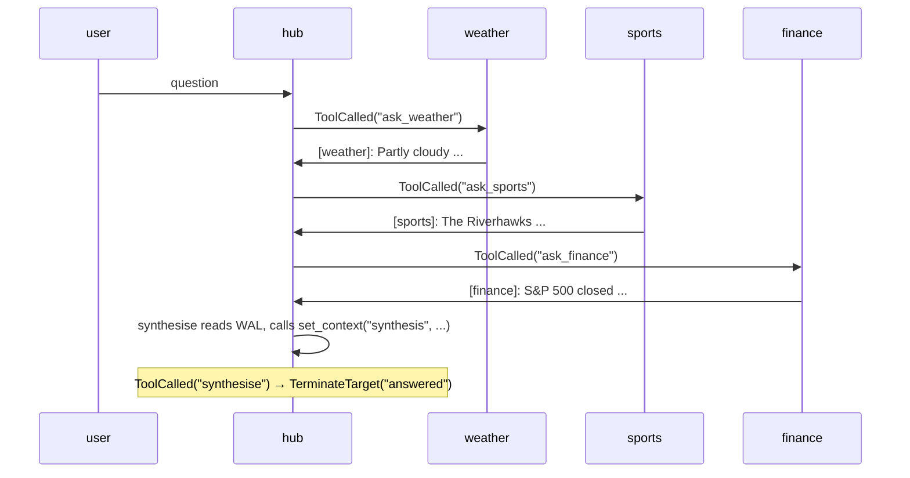

The Star pattern places one hub agent at the centre with several
specialist spokes. The hub fans out questions to the relevant spoke,
collects each reply, and synthesises a final answer. Spokes never
talk to each other; everything routes through the hub.

**Classic (non-beta) primitives:** `#!python DefaultPattern` with
`#!python OnContextCondition` routing, spoke handoffs returning to centre,
`#!python ContextVariables` tracking results.

### Key Characteristics

* **Single hub.** The hub picks which spoke to query, waits for the
  reply, then either delegates to another spoke or terminates with a
  synthesis.
* **Plain `#!python @tool` + `#!python ToolCalled` rule.** Each `#!python ask_<spoke>`
  tool is a normal Python function returning a status string. The
  graph's `#!python ToolCalled(name)` row matches the call and routes the
  next turn to the chosen spoke. The framework lifts the routing
  intent from the agent's local-stream `#!python ToolCallEvent` after the
  hub's round ends.
* **WAL-driven synthesis.** A `#!python synthesise` tool reads the spokes'
  actual replies straight from the WAL via `#!python HubInject` and stores
  the result in `#!python context_vars["synthesis"]` via `#!python set_context`.
  The graph's `#!python ToolCalled("synthesise")` rule terminates; the
  display code reads the stored synthesis after close.

### Routing Mechanics

* **Spokes return to hub.** `#!python FromSpeaker(<spoke>) → AgentTarget(hub)`
  rotates control back after each spoke replies.
* **Sender prefixing.** Spoke replies in this demo are prefixed with
  the spoke name in square brackets — e.g. `[weather]: Partly cloudy ...`.
  The default `#!python WindowedSummary` projection drops sender identity
  (each envelope becomes a plain user-role message), so an explicit
  prefix lets the hub LLM attribute each reply correctly when
  synthesising.

## Agent Flow



## Migration Notes

| Classic | Beta |
|---|---|
| Coordinator routes by inspecting `#!python ContextVariables` | Coordinator routes by calling per-spoke tools; each tool maps to a `#!python ToolCalled` transition |
| Spoke replies carry `#!python ReplyResult.target=AgentTarget(coordinator)` | `#!python FromSpeaker(<spoke>) → AgentTarget(hub)` rule rotates control back |
| Synthesis triggered by checking aggregated context | Synthesis triggered by an explicit `#!python synthesise` tool call; the tool reads the WAL via `#!python HubInject` and stores the result via `#!python set_context` |

## Code

!!! tip
    The hub uses real Sonnet (the routing decision is the LLM-driven
    part of the demo). The spokes use `#!python TestConfig` with
    pre-canned deterministic replies so the hub's synthesis turn can
    quote them cleanly without LLM-quality noise.

```python linenums="1"
"""Cookbook 03 — Star pattern.

A hub agent fans out to specialist spokes, each handling a single
domain. Spokes never talk to each other; everything flows through the
hub. The hub picks which spoke is relevant, waits for the reply, then
either delegates to another spoke or terminates with a synthesis.
"""

import asyncio

from dotenv import load_dotenv

from autogen.beta import Agent
from autogen.beta.config import AnthropicConfig
from autogen.beta.knowledge import MemoryKnowledgeStore
from autogen.beta.network import (
    EV_PACKET,
    EV_SESSION_CLOSED,
    EV_TEXT,
    WORKFLOW_TYPE,
    AgentTarget,
    FromSpeaker,
    Hub,
    HubClient,
    HubInject,
    LocalLink,
    Passport,
    Resume,
    SessionInject,
    TerminateTarget,
    ToolCalled,
    Transition,
    TransitionGraph,
)
from autogen.beta.network.workflow_helpers import set_context
from autogen.beta.testing import TestConfig

load_dotenv()


async def ask_weather(query: str) -> str:
    """Route the question to the weather spoke. The graph's
    ToolCalled('ask_weather') rule routes the next turn there."""
    print(f"  [tool] ask_weather({query!r})")
    return f"asking weather: {query}"


async def ask_sports(query: str) -> str:
    """Route the question to the sports spoke."""
    print(f"  [tool] ask_sports({query!r})")
    return f"asking sports: {query}"


async def ask_finance(query: str) -> str:
    """Route the question to the finance spoke."""
    print(f"  [tool] ask_finance({query!r})")
    return f"asking finance: {query}"


async def synthesise(headline: str, session: SessionInject, hub: HubInject) -> str:
    """Read each spoke's reply from the WAL, build a synthesis, store
    it in context_vars['synthesis']. The graph's ToolCalled('synthesise')
    rule terminates the workflow; main() reads the stored synthesis from
    context_vars after close."""
    if session is None or hub is None:
        return "no session or hub"
    print(f"  [tool] synthesise(headline={headline!r})")

    # Find each spoke's reply. Spoke replies are EV_PACKET envelopes
    # whose body starts with the spoke's name marker (e.g. "[weather]: ...").
    # EV_TEXT only carries the user's intake message in this demo.
    wal = await hub.read_wal(session.session_id)
    by_speaker: dict[str, str] = {}
    for env in wal:
        if env.event_type == EV_PACKET:
            text = env.event_data.get("body", "")
        elif env.event_type == EV_TEXT:
            text = env.event_data.get("text", "")
        else:
            continue
        if isinstance(text, str) and text:
            by_speaker[env.sender_id] = text

    bullets: list[str] = [f"**{headline.strip() or 'Roundup'}**", ""]
    for _, text in by_speaker.items():
        if text.startswith("[") and "]:" in text:
            bullets.append(f"- {text}")
    synthesis = "\n".join(bullets)

    await set_context(session, "synthesis", synthesis)
    return "synthesis posted"


async def main() -> None:
    config = AnthropicConfig(model="claude-sonnet-4-6")

    hub_obj = await Hub.open(MemoryKnowledgeStore(), ttl_sweep_interval=0)
    link = LocalLink(hub_obj)

    user_hc = HubClient(link, hub=hub_obj)
    hub_hc = HubClient(link, hub=hub_obj)
    weather_hc = HubClient(link, hub=hub_obj)
    sports_hc = HubClient(link, hub=hub_obj)
    finance_hc = HubClient(link, hub=hub_obj)

    user_agent = Agent("user", config=TestConfig())

    hub_agent = Agent(
        "hub",
        prompt=(
            "You are the hub of a Q&A star. Three specialist spokes are "
            "available: `ask_weather`, `ask_sports`, `ask_finance`.\n"
            "\n"
            "On each turn:\n"
            "1. Call exactly ONE tool. If you call more than one, only "
            "the first is used for routing — the others execute but "
            "their results aren't returned to you.\n"
            "2. After each spoke reply (it appears as a user-role "
            "message in your context, prefixed with the spoke name in "
            "square brackets — e.g. `[weather]: ...`), pick the next "
            "ask_* to call, or call `synthesise` once you have all the "
            "info.\n"
            "3. When all spokes have replied, call `synthesise` with a "
            "short `headline` string (one phrase, e.g. 'Daily Roundup'). "
            "The tool reads the spokes' actual replies from the WAL and "
            "composes the synthesis itself, then ends the workflow."
        ),
        config=config,
    )
    hub_agent.tool(ask_weather)
    hub_agent.tool(ask_sports)
    hub_agent.tool(ask_finance)
    hub_agent.tool(synthesise)

    weather_agent = Agent(
        "weather",
        config=TestConfig(
            "[weather]: Partly cloudy, 68°F, light southwesterly breeze; no precipitation expected."
        ),
    )
    sports_agent = Agent(
        "sports",
        config=TestConfig(
            "[sports]: The Riverhawks won 2-1 last night, with the winning goal scored in the 87th minute."
        ),
    )
    finance_agent = Agent(
        "finance",
        config=TestConfig(
            "[finance]: S&P 500 closed up 0.4% on cooling inflation data ahead of next week's Fed meeting."
        ),
    )

    user = await user_hc.register(user_agent, Passport(name="user"), Resume())
    central = await hub_hc.register(hub_agent, Passport(name="hub"), Resume())
    weather = await weather_hc.register(weather_agent, Passport(name="weather"), Resume())
    sports = await sports_hc.register(sports_agent, Passport(name="sports"), Resume())
    finance = await finance_hc.register(finance_agent, Passport(name="finance"), Resume())

    graph = TransitionGraph(
        initial_speaker=user.agent_id,
        transitions=[
            # Synthesis terminates first.
            Transition(when=ToolCalled("synthesise"), then=TerminateTarget("answered")),
            # Spokes always return to hub.
            Transition(when=FromSpeaker(weather.agent_id), then=AgentTarget(central.agent_id)),
            Transition(when=FromSpeaker(sports.agent_id),  then=AgentTarget(central.agent_id)),
            Transition(when=FromSpeaker(finance.agent_id), then=AgentTarget(central.agent_id)),
            # Hub's tool call routes to the chosen spoke.
            Transition(when=ToolCalled("ask_weather"), then=AgentTarget(weather.agent_id)),
            Transition(when=ToolCalled("ask_sports"),  then=AgentTarget(sports.agent_id)),
            Transition(when=ToolCalled("ask_finance"), then=AgentTarget(finance.agent_id)),
            # User's question → hub.
            Transition(when=FromSpeaker(user.agent_id), then=AgentTarget(central.agent_id)),
        ],
        default_target=TerminateTarget("fall_through"),
        max_turns=20,
    )

    session = await user.open(
        type=WORKFLOW_TYPE,
        target=[central.agent_id, weather.agent_id, sports.agent_id, finance.agent_id],
        knobs={"graph": graph.to_dict()},
    )
    print(f"session: {session.session_id}\n")

    name_by_id = {
        user.agent_id: "user",
        central.agent_id: "hub",
        weather.agent_id: "weather",
        sports.agent_id: "sports",
        finance.agent_id: "finance",
    }

    await session.send(
        "What's the weather like and how did the local football team do? "
        "Also a quick word on the markets."
    )

    # Wait for the workflow to terminate (any of the five close routes
    # documented in /docs/beta/network/termination — this demo uses
    # ToolCalled("synthesise") → TerminateTarget("answered")).
    close_env = await user_hc.wait_for_session_event(
        session_id=session.session_id,
        predicate=lambda e: e.event_type == EV_SESSION_CLOSED,
        timeout=240.0,
    )

    # Print the transcript from the WAL after close.
    for env in await hub_obj.read_wal(session.session_id):
        speaker = name_by_id.get(env.sender_id, env.sender_id[:8])
        if env.event_type == EV_TEXT:
            print(f"{speaker:>14}: {env.event_data['text']}")
        elif env.event_type == EV_PACKET:
            routing = env.event_data.get("routing", {}) or {}
            if routing.get("kind") == "handoff":
                line = f"[Handed off via {routing.get('tool', '')}] {routing.get('reason', '')}"
                print(f"{speaker:>14}: {line.rstrip()}")
            body = env.event_data.get("body", "")
            if body:
                print(f"{speaker:>14}: {body}")

    print(f"\nclosed: reason={close_env.event_data.get('reason')!r}")

    print("\n--- final synthesis ---")
    state = hub_obj._adapter_states[session.session_id]
    print(state.context_vars.get("synthesis", "(no synthesis)"))

    await user_hc.close()
    await hub_hc.close()
    await weather_hc.close()
    await sports_hc.close()
    await finance_hc.close()
    await hub_obj.close()


if __name__ == "__main__":
    asyncio.run(main())
```

## Output

```console
session: 4f2e...

           user: What's the weather like and how did the local football team do? Also a quick word on the markets.
  [tool] ask_weather('current weather conditions')
            hub: [Handed off via ask_weather] current weather conditions
        weather: [weather]: Partly cloudy, 68°F, light southwesterly breeze; no precipitation expected.
  [tool] ask_sports('local football team result')
            hub: [Handed off via ask_sports] local football team result
         sports: [sports]: The Riverhawks won 2-1 last night, with the winning goal scored in the 87th minute.
  [tool] ask_finance('quick markets summary')
            hub: [Handed off via ask_finance] quick markets summary
        finance: [finance]: S&P 500 closed up 0.4% on cooling inflation data ahead of next week's Fed meeting.
  [tool] synthesise(headline='Daily Roundup')
            hub: [Handed off via synthesise]

closed: reason='answered'

--- final synthesis ---
**Daily Roundup**

- [weather]: Partly cloudy, 68°F, light southwesterly breeze; no precipitation expected.
- [sports]: The Riverhawks won 2-1 last night, with the winning goal scored in the 87th minute.
- [finance]: S&P 500 closed up 0.4% on cooling inflation data ahead of next week's Fed meeting.
```
