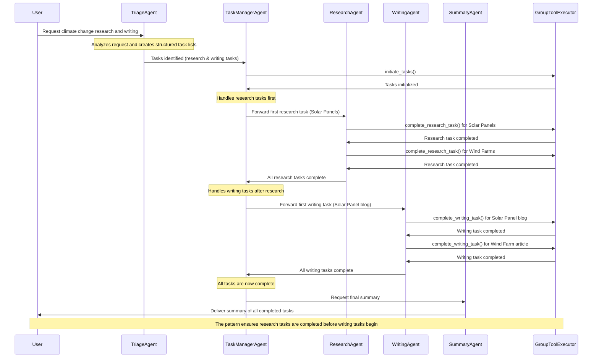

The Triage with Tasks Pattern is a workflow orchestration approach that breaks down complex user requests into structured task sequences with specialized agents handling specific task types in a sequential order.

This pattern excels at managing interdependent work where certain tasks must precede others, such as research before writing, while maintaining organized tracking of task status, priorities, and dependencies throughout the process.

By creating a clear task taxonomy and enforcing execution order, this pattern ensures each component of a complex request is handled by the most appropriate specialist agent while preserving the logical workflow dependencies.

This pattern is used within our [`DocAgent`](/docs/user-guide/reference-agents/docagent) ([code](https://github.com/ag2ai/ag2/blob/main/autogen/agents/experimental/document_agent/document_agent.py)).

### Key Characteristics


The Triage with Tasks Pattern establishes a structured workflow where complex requests are decomposed into discrete, prioritized tasks that flow through specialized agents in a predetermined sequence.

* **Task Decomposition**: Initial triage breaks requests into categorized tasks (e.g., research, writing).

* **Sequential Task Processing**: Tasks are processed in a logical order with enforced prerequisites (e.g., research tasks must complete before dependent writing tasks begin).

* **Specialized Task Agents**: Dedicated agents handle specific task types, focusing exclusively on their domain expertise.

* **Dynamic Task Management**: A central task manager tracks progress, maintains context, and routes tasks to appropriate agents based on current state and dependencies.

### Information Flow


The Triage with Tasks Pattern creates a structured information pipeline where tasks flow from initial triage agent through specialized processors in a determined sequence.

* **Triage Stage**: User requests are analyzed and decomposed into categorized, pre-defined, tasks.

* **Task Distribution**: Tasks flow through a central task manager that enforces the sequence, ensuring prerequisite tasks are completed before dependent ones begin.

* **Specialized Processing**: Each task is processed by a domain-specific agent that adds its expertise to the task output.

* **Consolidated Results**: Upon completion of all tasks, results are gathered and presented as a cohesive summary that reflects the relationships between the different task outputs.

### Implementation

Our implementation using AG2's Group Chat demonstrates the Triage with Tasks Pattern with a structured system that breaks user requests into research and writing tasks, ensuring research is completed before dependent writing begins, while maintaining comprehensive task tracking.

* **Structured Data Models**: Pydantic models (ResearchTask, WritingTask) define the explicit schema for different task types, ensuring consistent tracking and processing.

* **Context-Aware Task Management**: The TaskManager maintains rich context including task lists, completion status, and current task indices to ensure proper sequencing.

* **Dynamic System Messages**: Agent prompts update based on context, ensuring each agent always has current information about its assigned task.

* **Conditional Hand-offs**: [`OnContextCondition`](/docs/api-reference/autogen/agentchat/group/on_context_condition/OnContextCondition) transitions efficiently route tasks based on current state, ensuring research is completed before writing begins, and providing a comprehensive summary when all tasks are finished.

## Agent Flow



## Code

<Tip>
In this code example we use OpenAI's GPT-4o mini with structured outputs.

We also set the LLM parameter `parallel_tool_calls` to False so that our agents don't recommend more than one tool call at a time. This parameter may not be available with all model providers.
</Tip>

```python
... (rest of the code unchanged)
```

## Output

```console
... (rest of the output unchanged)
```
