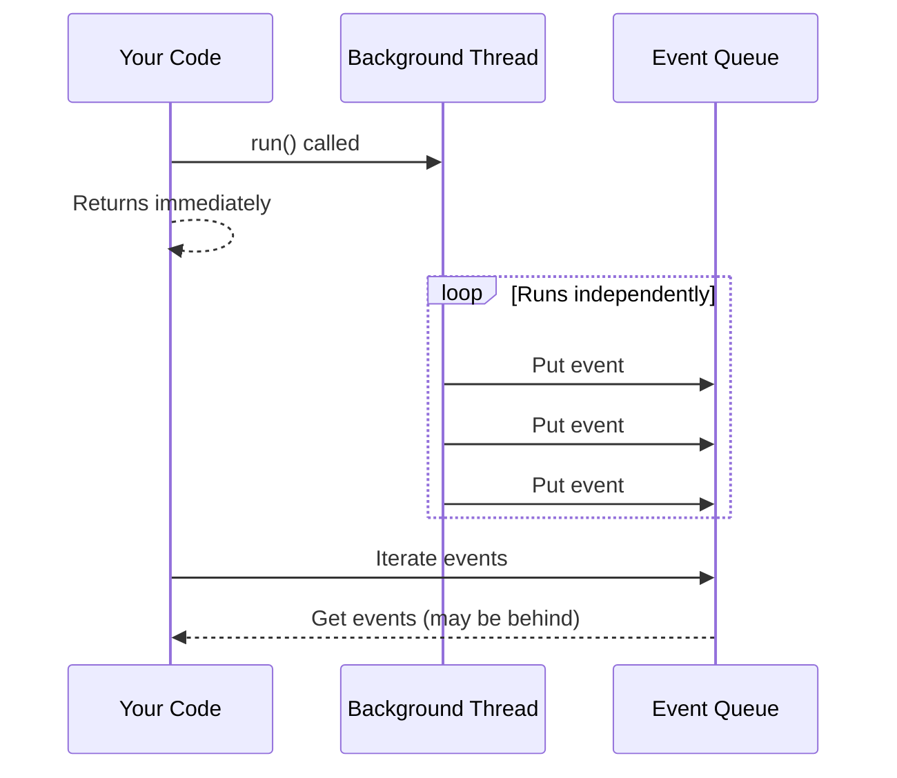
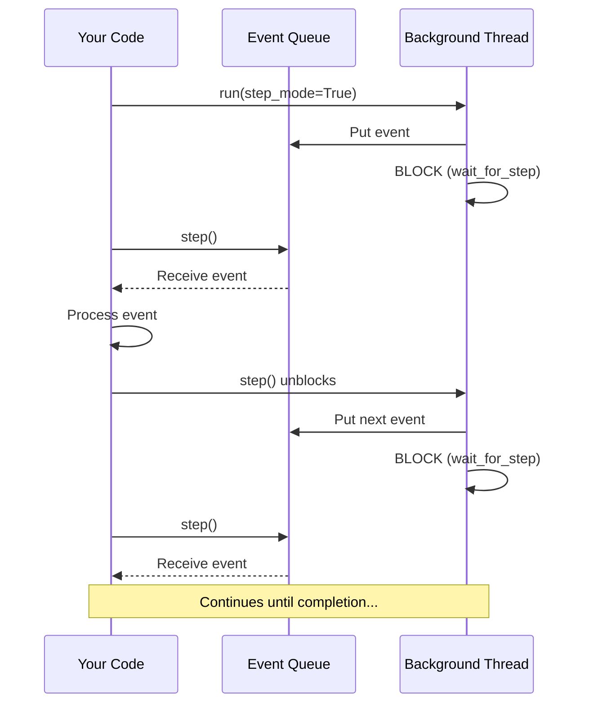

Step mode gives you fine-grained control over agent execution by pausing after each event. This is essential for debugging, implementing human-in-the-loop workflows, and building interactive applications.

## Why Step Mode?

When you call `run()` or `run_group_chat()`, the agent conversation executes in a **background thread** that runs independently:



This design is great for streaming UIs, but makes it difficult to:

- **Debug step-by-step** - Execution races ahead while you inspect events
- **Implement human-in-the-loop** - Hard to pause for approval before actions
- **Build interactive tools** - Can't gate execution on user decisions

**Step mode** solves this by synchronizing execution - the background thread blocks after each event until you explicitly call `step()` to continue.

## Getting Started

Enable step mode by passing `step_mode=True` to `run()`:

```python
import os
from autogen import ConversableAgent, LLMConfig

llm_config = LLMConfig(api_type="openai", model="gpt-4o-mini", api_key=os.environ["OPENAI_API_KEY"])

assistant = ConversableAgent(
    "Assistant",
    system_message="You are a helpful assistant. Say DONE when finished.",
    is_termination_msg=lambda x: "DONE" in x.get("content", ""),
    llm_config=llm_config,
)

# Enable step mode
with assistant.run(message="Hello!", max_turns=2, step_mode=True) as response:
    while True:
        event = response.step()  # Get next event
        if event is None:
            print("Run completed!")
            break
        print(f"Event: {event.type}")
```

### Key Points

1. **Use `step_mode=True`** to enable step-by-step execution
2. **Call `response.step()`** to advance to the next event
3. **`step()` returns `None`** when the run completes
4. **Use the context manager** (`with ... as response`) for safe cleanup

The context manager ensures the background thread exits cleanly, even if an exception occurs in your code.

## Filtering Events with `step_on`

By default, step mode stops on every event. Use `step_on` to filter which events pause execution:

```python
from autogen.events.agent_events import TextEvent, ToolCallEvent, TerminationEvent

with assistant.run(
    message="Calculate 2 + 2",
    max_turns=3,
    step_mode=True,
    step_on=[TextEvent, ToolCallEvent, TerminationEvent],  # Only stop on these
) as response:
    while True:
        event = response.step()
        if event is None:
            break

        if isinstance(event, TextEvent):
            print(f"Text from {event.content.sender}: {event.content.content}")
        elif isinstance(event, ToolCallEvent):
            print(f"Tool call: {event.content.tool_calls}")
```

### Common Event Types

| Event Type | Description |
|------------|-------------|
| `TextEvent` | Agent sends or receives a text message |
| `ToolCallEvent` | Agent wants to call a tool |
| `ToolResponseEvent` | Tool returns a result |
| `ExecutedFunctionEvent` | Function execution completed |
| `TerminationEvent` | Conversation terminates |
| `GroupChatRunChatEvent` | Agent selected to speak in group chat |

### Special Events (Always Returned)

These events bypass the `step_on` filter because they require immediate handling:

| Event Type | Behavior |
|------------|----------|
| `InputRequestEvent` | Always returned - user must respond |
| `ErrorEvent` | Raises as exception |
| `RunCompletionEvent` | Signals completion (`step()` returns `None`) |

### Handling Input Requests

When an agent requests human input, you must respond:

```python
from autogen.events.agent_events import InputRequestEvent

with assistant.run(message="Ask me a question", step_mode=True) as response:
    while True:
        event = response.step()
        if event is None:
            break

        if isinstance(event, InputRequestEvent):
            user_input = input(event.content.prompt)
            event.content.respond(user_input)
            continue

        # Handle other events...
```

## Step Mode with Group Chat

Step mode works with `run_group_chat()` for multi-agent conversations:

```python
from autogen.agentchat.group.multi_agent_chat import run_group_chat
from autogen.agentchat.group.patterns import AutoPattern
from autogen.events.agent_events import GroupChatRunChatEvent, TextEvent

# Create agents
coder = ConversableAgent("Coder", system_message="Write code.", llm_config=llm_config)
reviewer = ConversableAgent("Reviewer", system_message="Review code.", llm_config=llm_config)

pattern = AutoPattern(
    initial_agent=coder,
    agents=[coder, reviewer],
    group_manager_args={"llm_config": llm_config},
)

# Step through the group chat
with run_group_chat(
    pattern=pattern,
    messages="Write a hello world function",
    max_rounds=4,
    step_mode=True,
    step_on=[GroupChatRunChatEvent, TextEvent],
) as response:
    while True:
        event = response.step()
        if event is None:
            break

        if isinstance(event, GroupChatRunChatEvent):
            print(f"\n=== {event.content.speaker}'s turn ===")
        elif isinstance(event, TextEvent):
            print(f"{event.content.content[:100]}...")
```

## Practical Use Cases

### Aborting Execution

Break out of the step loop to stop execution immediately:

```python
from autogen.events.agent_events import ToolCallEvent
import json

BLOCKED_ACTIONS = ["delete_file", "send_email"]

with assistant.run(message="Delete the config file", step_mode=True) as response:
    aborted = False
    while True:
        event = response.step()
        if event is None:
            break

        if isinstance(event, ToolCallEvent):
            for tool_call in event.content.tool_calls:
                if tool_call.function.name in BLOCKED_ACTIONS:
                    print(f"BLOCKED: {tool_call.function.name}")
                    aborted = True
                    break
            if aborted:
                break  # Exit the loop - execution stops

if aborted:
    print("Execution was aborted before the action could run.")
```

### Human Approval for Tools

Prompt for approval before tool execution:

```python
with assistant.run(message="Send an email", step_mode=True) as response:
    while True:
        event = response.step()
        if event is None:
            break

        if isinstance(event, ToolCallEvent):
            for tool_call in event.content.tool_calls:
                print(f"Agent wants to call: {tool_call.function.name}")
                print(f"Arguments: {tool_call.function.arguments}")
                approval = input("Approve? (y/n): ")
                if approval.lower() != 'y':
                    print("Rejected - aborting")
                    break
```

## How It Works: The Step Controller

The `StepController` synchronizes the producer (background thread) and consumer (your code):



### Why Context Managers Matter

If your code raises an exception during the step loop, `step()` is never called again. Without cleanup, the background thread blocks forever:

```python
# PROBLEM - thread may hang if exception occurs
response = assistant.run(..., step_mode=True)
while True:
    event = response.step()
    process(event)  # If this raises, thread hangs!

# FIX - context manager ensures cleanup
with assistant.run(..., step_mode=True) as response:
    while True:
        event = response.step()
        process(event)  # If this raises, cleanup happens automatically
```

The context manager calls `response.close()` which terminates the step controller, allowing the background thread to exit.

## Creating your own Custom Events

You can create custom events to pause on your domain-specific conditions.

### Requirements

1. Inherit from `BaseEvent`
2. Use the `@wrap_event` decorator
3. Class name must end with `Event`

```python
from typing import Any, Callable
from autogen.events.base_event import BaseEvent, wrap_event, resolve_print_callable

@wrap_event
class ValidationCheckpointEvent(BaseEvent):
    """Custom event for validation checkpoints."""
    checkpoint_name: str
    records_processed: int
    passed: bool

    def print(self, f: Callable[..., Any] | None = None) -> None:
        f = resolve_print_callable(f)
        status = "PASSED" if self.passed else "FAILED"
        f(f"[Checkpoint] {self.checkpoint_name}: {status}", flush=True)
```

### Emitting Custom Events

Emit events from within tools using `IOStream`:

```python
from autogen.io.base import IOStream
from autogen.tools import tool

@tool(description="Process data through validation stages")
def process_data(source: str, count: int) -> str:
    # Stage 1
    IOStream.get_default().send(
        ValidationCheckpointEvent(
            checkpoint_name="extraction",
            records_processed=count,
            passed=True,
        )
    )

    # Stage 2
    IOStream.get_default().send(
        ValidationCheckpointEvent(
            checkpoint_name="validation",
            records_processed=count,
            passed=count > 0,
        )
    )

    return f"Processed {count} records"
```

### Stepping on Custom Events

Add your custom event to `step_on`:

```python
with assistant.run(
    message="Process the data",
    step_mode=True,
    step_on=[ValidationCheckpointEvent, TextEvent],
) as response:
    while True:
        event = response.step()
        if event is None:
            break

        if isinstance(event, ValidationCheckpointEvent):
            print(f"Checkpoint: {event.content.checkpoint_name}")
            if not event.content.passed:
                print("Validation failed - aborting")
                break
```

## API Reference

### `run()` Parameters

| Parameter | Type | Default | Description |
|-----------|------|---------|-------------|
| `step_mode` | `bool` | `False` | Enable step-by-step execution |
| `step_on` | `Sequence[type[BaseEvent]]` | `None` | Event types to stop on (None = all events) |

### `run_group_chat()` Parameters

| Parameter | Type | Default | Description |
|-----------|------|---------|-------------|
| `step_mode` | `bool` | `False` | Enable step-by-step execution |
| `step_on` | `Sequence[type[BaseEvent]]` | `None` | Event types to stop on (None = all events) |

### Async Support

Async versions are fully supported:

```python
async with await assistant.a_run(..., step_mode=True) as response:
    while True:
        event = await response.step()
        if event is None:
            break
        # Process event
```

## Summary

Step mode provides precise control over agent execution:

- **`step_mode=True`** - Enable step-by-step execution
- **`step_on=[...]`** - Filter which events to pause on
- **`response.step()`** - Advance to the next event
- **Context manager** - Use `with ... as response:` for safe cleanup
- **Custom events** - Create domain-specific pause points

Use step mode for:
- Debugging agent conversations
- Human-in-the-loop approval workflows
- Aborting execution based on conditions
- Monitoring and logging all events
- Building interactive agent applications
