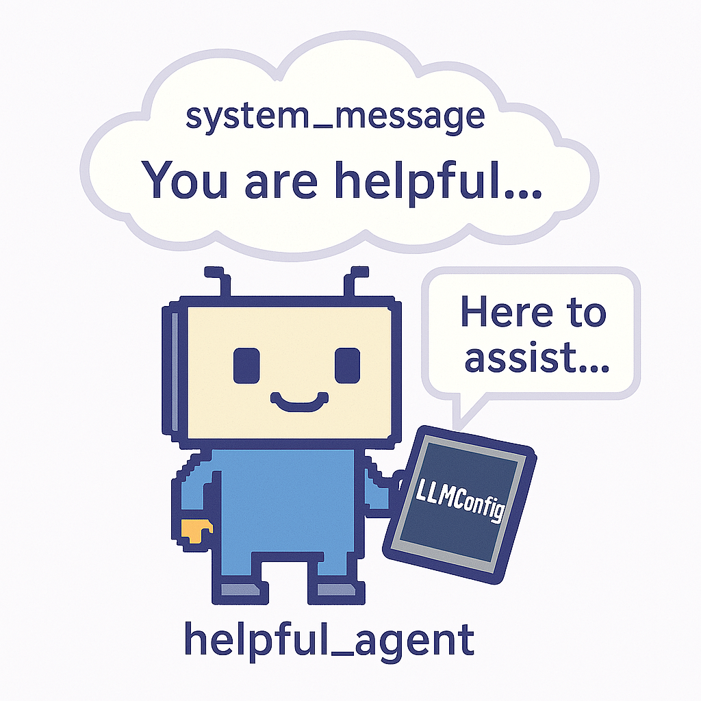

ConversableAgent is at the heart of all AG2 agents while also being a fully functioning agent on its own. It provides the foundation for creating conversational AI agents that can communicate with users, other agents, and execute functions.

## What is ConversableAgent?

ConversableAgent is a versatile base class that enables agents to:

- Exchange messages with users and other agents
- Generate responses using language models
- Execute functions and tools
- Process and maintain conversation history
- Support human-in-the-loop interactions
- Execute code securely

Whether you're creating a simple assistant or building a complex multi-agent system, ConversableAgent provides the essential building blocks for agent-based AI applications.

---

## ConversableAgent at a Glance

---

## Example: Talking to Your Own AI Agent

import Example from "/snippets/python-examples/conversableagentchat.mdx";

<Example />

---

## Step-by-Step Breakdown

1. **Import the class**
   Bring in `ConversableAgent` and `LLMConfig` from the `autogen` library.

2. **Define your LLM**
   Use `LLMConfig` to set up your preferred model and API credentials.

3. **Create the Agent**
   Instantiate a `ConversableAgent`, assign it a name, and give it a purpose using the `system_message`.

4. **Chat with the Agent**
   Call `.run()` to send your first message. The agent will reply immediately.

5. **Handle the Conversation**
   Use `.process()` to continue the conversation or respond programmatically.

---

## Why Use ConversableAgent?

- Great for quick tests or prototypes
- Easily extended into multi-agent workflows
- Supports tool usage, memory, and more

---

For more advanced usage, check out [AssistantAgent](/docs/api-reference/autogen/AssistantAgent) or [UserProxyAgent](/docs/api-reference/autogen/UserProxyAgent).
