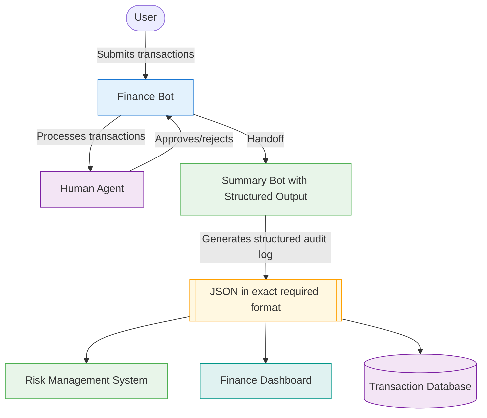

In our financial compliance system, we've built a workflow that checks transactions, detects duplicates, and generates summary reports. Everything seems to be working well, but then we get a new requirement:

*The risk management team needs to integrate our transaction summary reports with their systems, and they need the data in a specific format.*

Our summary agent currently produces nice-looking reports, but the output format isn't guaranteed. The agent decides how to format the data based on its system message instructions. This inconsistency makes it impossible for the risk management system to reliably extract the data it needs.

What we need is a way to ensure our summary bot always produces reports in exactly the same structured format, regardless of the specific transactions being processed.

## The Need for Structured Outputs

We're faced with a common challenge in AI systems: how do we get our agents to output information in a consistent, predictable format that other systems can understand?

Think about it like this - our finance bot and summary bot are doing great work analyzing transactions, but if we want to connect them to other business systems, we need something more reliable than hoping they'll format data consistently each time.

This is where structured outputs come in - they provide a way to define the exact structure your agent's responses should follow.

**An Analogy for Structured Outputs:**

Continuing our hospital emergency room analogy:

- Think of structured outputs like standardized medical forms used in the hospital
- Without standardized forms, each doctor might document patient information differently (freeform text)
- With standardized forms, all required fields must be completed and in the correct format
- Technicians know exactly where to find vitals, lab results, and medications without guessing
- Downstream systems (insurance, billing, pharmacy) can reliably process these forms
- The forms act as guardrails, ensuring all necessary information is captured and consistently structured

Just as standardized medical forms ensure complete and consistent documentation across different healthcare providers, structured outputs ensure your agents produce responses in a predictable format that can be reliably processed by other systems.

## From Concept to Implementation

Implementing structured outputs in AG2 is straightforward using JSON schema dictionaries and the [`response_format`](/docs/api-reference/autogen/llm_config/LLMConfigEntry#response_format) parameter, especially with modern ("openai_v2") clients:

<Note>
Not all model providers support structured outputs. For a current list of supported providers, see [here](https://docs.ag2.ai/latest/docs/use-cases/notebooks/notebooks/agentchat_structured_outputs/?h=structured#supported-model-providers).
</Note>

```python hl_lines="8-34 38"
# 1. Define your structured output schema as a JSON schema dictionary
response_json_schema = {
    "type": "object",
    "properties": {
        "field1": {"type": "string"},
        "field2": {"type": "integer"},
        "field3": {
            "type": "array",
            "items": {"type": "string"}
        }
    },
    "required": ["field1", "field2", "field3"],
    "additionalProperties": False
}

from autogen import ConversableAgent

# 2. Create LLM configuration with the structured output schema for V2 clients
llm_config = {
    "config_list": [{
        "api_type": "openai_v2",
        "model": "gpt-5-nano",
        # Note: Set your api_key here
    }],
    "temperature": 0,
    "response_format": {"type": "json_schema", "json_schema": response_json_schema}
}

# 3. Create agent with structured output configuration
structured_agent = ConversableAgent(
    name="structured_agent",
    system_message="You provide information in a structured format.",
    llm_config=llm_config,
)
```

With this setup:

- The agent will always return responses that match the JSON schema structure
- All required fields will be present and correctly typed
- You no longer need formatting instructions in the system message
- The responses can be easily parsed and processed by other systems via `json.loads(response.text)`

## Enhancing Our Financial Compliance System with Structured Outputs

Now, let's enhance our financial compliance system by adding structured outputs to our summary agent:

### Defining the Structured Output Schema

First, let's define our structured output as a JSON schema for transaction audit logs:

```python
# Define structured output as JSON schema for audit logs
audit_log_json_schema = {
    "type": "object",
    "properties": {
        "total_transactions": {"type": "integer"},
        "approved_count": {"type": "integer"},
        "rejected_count": {"type": "integer"},
        "transactions": {
            "type": "array",
            "items": {
                "type": "object",
                "properties": {
                    "vendor": {"type": "string"},
                    "amount": {"type": "number"},
                    "memo": {"type": "string"},
                    "status": {"type": "string"},
                    "reason": {"type": "string"}
                },
                "required": ["vendor", "amount", "memo", "status", "reason"],
                "additionalProperties": False
            }
        },
        "summary_generated_time": {"type": "string"}
    },
    "required": ["total_transactions", "approved_count", "rejected_count", "transactions", "summary_generated_time"],
    "additionalProperties": False
}
```

### Creating the Summary Agent with Structured Output

Next, let's update our summary agent to use this structured output schema:

```python hl_lines="6-10 19"
# Configure the LLM for summary bot with structured output
summary_llm_config = {
    "config_list": [{
        "api_type": "openai_v2",
        "model": "gpt-5-nano",
        "api_key": os.environ.get("OPENAI_API_KEY"),
        "temperature": 0.2,
        "response_format": {"type": "json_schema", "json_schema": audit_log_json_schema}
    }],
}

# Define the system message for the summary agent
# Note: No formatting instructions needed!
summary_system_message = """
You are a financial summary assistant that generates audit logs.
Analyze the transaction details and their approval status from the conversation.
Include each transaction with its vendor, amount, memo, status and reason.
"""

summary_bot = ConversableAgent(
    name="summary_bot",
    system_message=summary_system_message,
    llm_config=summary_llm_config,
)
```

Notice how much simpler the system message is now - we no longer need to include detailed formatting instructions because the structure is enforced by the JSON schema.

### Updating the Termination Condition

We'll also update our termination condition to recognize the structured output:

```python
def is_termination_msg(x: dict[str, Any]) -> bool:
    content = x.get("content", "")
    try:
        # Try to parse the content as JSON (structured output)
        data = json.loads(content)
        return isinstance(data, dict) and "summary_generated_time" in data
    except:
        # If not JSON, check for text marker (fallback)
        return (content is not None) and "==== SUMMARY GENERATED ====" in content
```

### Using the Structured Output

After the Group Chat completes, we can easily get the final message and parse it as JSON. For example:

```python hl_lines="13-15"
pattern = AutoPattern(
    initial_agent=finance_bot,
    agents=[finance_bot, summary_bot],
    user_agent=human,
    group_manager_args = {
        "llm_config": finance_llm_config,
        "is_termination_msg": is_termination_msg
    },
)

result, _, _ = initiate_group_chat(
    pattern=pattern,
    messages=initial_prompt,
)

final_message = result.chat_history[-1]["content"]
structured_data = json.loads(final_message)
print(json.dumps(structured_data, indent=4))
```

### Understanding the Enhanced Workflow

With structured outputs added to our financial compliance system, our workflow becomes much more reliable:



## Complete Code Example

Here's the complete, ready-to-run code for our financial compliance system with structured outputs **using JSON schema and modern openai_v2 clients**:

???+ info "Complete Code Example"

    ```python
    import os
    import random
    import json
    from typing import Annotated, Any, List, Dict
    from datetime import datetime, timedelta

    from autogen import ConversableAgent
    from autogen.agentchat import initiate_group_chat
    from autogen.agentchat.group.patterns import AutoPattern

    # Mock database of previous transactions (same as before)
    def get_previous_transactions() -> list[dict[str, Any]]:
        today = datetime.now()
        return [
            {
                "vendor": "Staples",
                "amount": 500,
                "date": (today - timedelta(days=3)).strftime("%Y-%m-%d"),
                "memo": "Quarterly supplies",
            },
            {
                "vendor": "Acme Corp",
                "amount": 1500,
                "date": (today - timedelta(days=10)).strftime("%Y-%m-%d"),
                "memo": "NDA services",
            },
            {
                "vendor": "Globex",
                "amount": 12000,
                "date": (today - timedelta(days=5)).strftime("%Y-%m-%d"),
                "memo": "Confidential",
            },
        ]

    def check_duplicate_payment(
        vendor: Annotated[str, "The vendor name"],
        amount: Annotated[float, "The transaction amount"],
        memo: Annotated[str, "The transaction memo"]
    ) -> dict[str, Any]:
        previous_transactions = get_previous_transactions()
        today = datetime.now()
        for tx in previous_transactions:
            tx_date = datetime.strptime(tx["date"], "%Y-%m-%d")
            date_diff = (today - tx_date).days
            if (
                tx["vendor"] == vendor and
                tx["memo"] == memo and
                tx["amount"] == amount and
                date_diff <= 7
            ):
                return {
                    "is_duplicate": True,
                    "reason": f"Duplicate payment to {vendor} for ${amount} on {tx['date']}"
                }
        return {
            "is_duplicate": False,
            "reason": "No recent duplicates found"
        }

    # Configure the LLM for finance bot (standard configuration)
    finance_llm_config = {
        "config_list": [{
            "api_type": "openai_v2",
            "model": "gpt-5-nano",
            "api_key": os.environ.get("OPENAI_API_KEY"),
            "temperature": 0.2
        }]
    }

    finance_system_message = """
    You are a financial compliance assistant. You will be given a set of transaction descriptions.
    [content omitted for brevity]
    """

    finance_bot = ConversableAgent(
        name="finance_bot",
        system_message=finance_system_message,
        functions=[check_duplicate_payment],
        llm_config=finance_llm_config,
    )

    human = ConversableAgent(
        name="human",
        human_input_mode="ALWAYS",
    )

    # JSON schema for structured output audit log
    audit_log_json_schema = {
        "type": "object",
        "properties": {
            "total_transactions": {"type": "integer"},
            "approved_count": {"type": "integer"},
            "rejected_count": {"type": "integer"},
            "transactions": {
                "type": "array",
                "items": {
                    "type": "object",
                    "properties": {
                        "vendor": {"type": "string"},
                        "amount": {"type": "number"},
                        "memo": {"type": "string"},
                        "status": {"type": "string"},
                        "reason": {"type": "string"}
                    },
                    "required": ["vendor", "amount", "memo", "status", "reason"],
                    "additionalProperties": False
                }
            },
            "summary_generated_time": {"type": "string"}
        },
        "required": ["total_transactions", "approved_count", "rejected_count", "transactions", "summary_generated_time"],
        "additionalProperties": False
    }

    summary_llm_config = {
        "config_list": [{
            "api_type": "openai_v2",
            "model": "gpt-5-nano",
            "api_key": os.environ.get("OPENAI_API_KEY"),
            "temperature": 0.2,
            "response_format": {"type": "json_schema", "json_schema": audit_log_json_schema}
        }]
    }

    summary_system_message = """
    You are a financial summary assistant that generates audit logs.
    Analyze the transaction details and their approval status from the conversation.
    Include each transaction with its vendor, amount, memo, status and reason.
    """

    summary_bot = ConversableAgent(
        name="summary_bot",
        system_message=summary_system_message,
        llm_config=summary_llm_config,
    )

    def is_termination_msg(x: dict[str, Any]) -> bool:
        content = x.get("content", "")
        try:
            data = json.loads(content)
            return isinstance(data, dict) and "summary_generated_time" in data
        except:
            return (content is not None) and "==== SUMMARY GENERATED ====" in content

    transactions = [
        "Transaction: $500 to Staples. Memo: Quarterly supplies.",
        "Transaction: $4000 to Unicorn LLC. Memo: Reimbursement.",
        "Transaction: $12000 to Globex. Memo: Confidential.",
        "Transaction: $22000 to Initech. Memo: Urgent request."
    ]
    initial_prompt = (
        "Please process the following transactions one at a time, checking for duplicates:\n\n" +
        "\n".join([f"{i+1}. {tx}" for i, tx in enumerate(transactions)])
    )

    pattern = AutoPattern(
        initial_agent=finance_bot,
        agents=[finance_bot, summary_bot],
        user_agent=human,
        group_manager_args = {
            "llm_config": finance_llm_config,
            "is_termination_msg": is_termination_msg
        },
    )

    result, _, _ = initiate_group_chat(
        pattern=pattern,
        messages=initial_prompt,
    )

    # Pretty-print the transaction_data
    final_message = result.chat_history[-1]["content"]
    structured_data = json.loads(final_message)
    print(json.dumps(structured_data, indent=4))
    ```

## Example Output

When you run this code, you'll receive a perfectly structured JSON output (shown here with pretty-printing):

[output content omitted for brevity, unchanged]
```

## Key Benefits of Structured Outputs

Structured outputs offer several compelling benefits:

- **Consistency**: Every response has the same structure, making integration reliable
- **Validation**: Built-in type checking ensures data integrity
- **Simplicity**: Reduced need for complex formatting instructions in system messages
- **Integration**: Easy to parse and use in downstream systems
- **Maintainability**: Schema changes can be managed centrally

## Next Steps

You've now learned how to create a complete financial compliance system incorporating the basic concepts of AG2:

- **LLM Configuration**: Powering our agents with the right language models
- **ConversableAgent**: Creating smart, interactive agents for different tasks
- **Human in the Loop**: Adding human oversight for suspicious transactions
- **Agent Orchestration**: Coordinating multiple specialized agents with the Group Chat pattern
- **Tools**: Extending agent capabilities with duplicate payment detection
- **Structured Outputs**: Ensuring consistent, validated summary reports

In the Advanced Concepts section, you'll learn how to further enhance your AG2 applications with more sophisticated patterns, agent capabilities, and integration options. You'll also find more in-depth explanations of the concepts we've covered here, allowing you to build even more powerful multi-agent systems.
