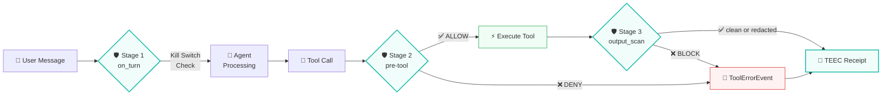
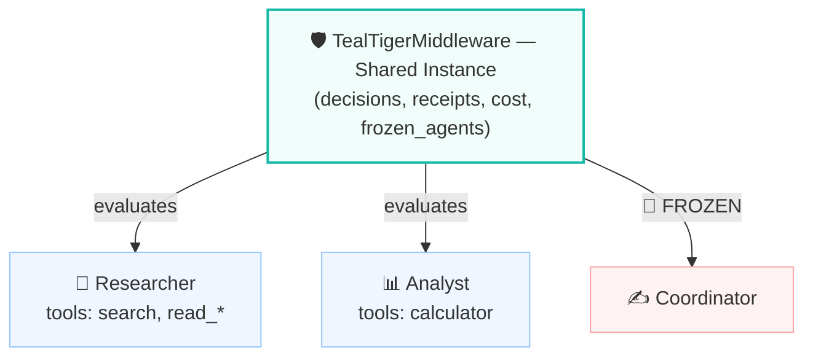
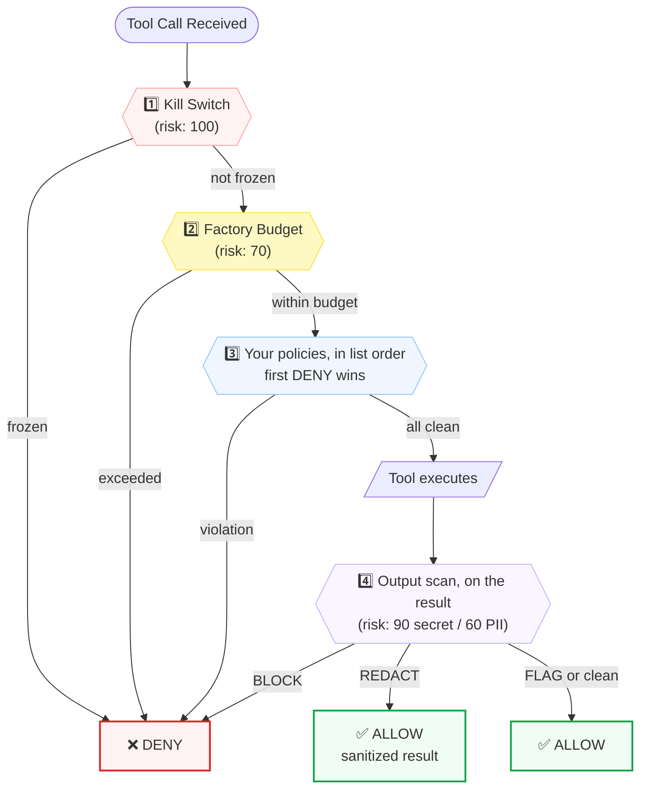
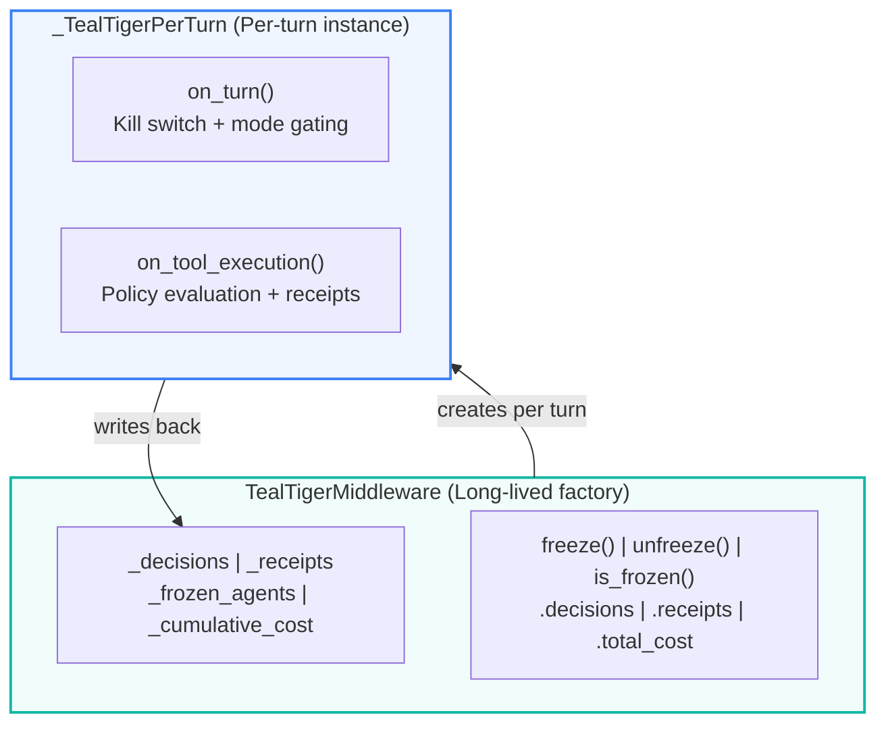

The `ag2.extensions.tealtiger` module adds deterministic governance guardrails to AG2 agents. `TealTigerMiddleware` enforces tool allowlists and blocklists, validates tool arguments, detects PII and secrets in tool arguments and in tool results, blocks prompt injection attempts, tracks per-session cost, provides per-agent kill switches, and produces structured TEEC audit receipts — with no LLM in the governance path.

## Installation

!!! note
    The extension ships with AG2. No additional Python package and no API key are required — all governance evaluation runs inline on the standard library.

```bash
pip install ag2
```

Import directly:

```python linenums="1"
from ag2.extensions.tealtiger import (
    GovernanceDecision,
    GovernanceMode,
    GovernancePolicy,
    OutputAction,
    TEECReceipt,
    TealTigerMiddleware,
)
```

## Quick Start

`TealTigerMiddleware` is a [middleware factory](/docs/user-guide/middleware) — pass the instance straight into an agent's `middleware` list.

```python linenums="1" hl_lines="7-16 21"
import asyncio

from ag2 import Agent
from ag2.config import AnthropicConfig
from ag2.extensions.tealtiger import GovernanceMode, GovernancePolicy, TealTigerMiddleware

governance = TealTigerMiddleware(
    mode=GovernanceMode.ENFORCE,
    policies=[
        GovernancePolicy.prompt_injection_block(),
        GovernancePolicy.tool_allowlist(["search", "read_*"]),
        GovernancePolicy.pii_block(["ssn", "credit_card", "email", "phone"]),
        GovernancePolicy.secret_detection(),
        GovernancePolicy.cost_limit(max_per_session=5.0),
    ],
)

async def main() -> None:
    agent = Agent(
        "assistant",
        config=AnthropicConfig(model="claude-sonnet-5"),
        middleware=[governance],
    )
    reply = await agent.ask("Summarize the AG2 middleware guide.")
    print(await reply.content())
    print(governance.decisions)
    print(f"Cost: ${governance.total_cost:.4f}")

if __name__ == "__main__":
    asyncio.run(main())
```

Every tool call now flows through deterministic governance evaluation before execution.

## Multi-Stage Defense

TealTiger governs at three stages of the AG2 agent lifecycle:



| Hook | Stage | What It Does |
|------|-------|-------------|
| `on_turn` | Turn defense | Kill switch enforcement — frozen agents cannot take turns |
| `on_tool_execution` | Pre-tool defense | Tool allowlist/blocklist, argument validation, PII scan, secret scan, cost limit check |
| `on_tool_execution` | Post-tool defense | Output scan — PII and secrets in the tool's *result*, before it re-enters the model's context |

All three stages activate from a single middleware instance. The **middleware factory** pattern keeps state (decisions, receipts, cost, frozen agents) alive across turns.

!!! note "Receipts come from the tool stage"

    A `TEECReceipt` is emitted for every *tool* evaluation, whether the call was executed or blocked. Turn-level kill switch denials record a `GovernanceDecision` but do **not** emit a receipt.

## Governance Modes

| Mode | Behavior | Use Case |
|------|----------|----------|
| **ENFORCE** | Evaluates all policies. Blocks violations with `ToolErrorEvent`. | Production |
| **MONITOR** | Evaluates all policies, records decisions, but **never blocks**. | Staging / shadow testing |
| **OBSERVE** | Skips policy evaluation. Passes through, still tracks cost and records an `OBSERVE_PASSTHROUGH` decision. | Initial rollout / lowest overhead |

`mode` accepts either a `GovernanceMode` member or its string name, and defaults to `GovernanceMode.ENFORCE`. Start with `MONITOR` in staging to see what would be blocked, then switch to `ENFORCE` in production:

```python linenums="1"
# Shadow mode — see what governance would deny without blocking anything
governance = TealTigerMiddleware(
    mode=GovernanceMode.MONITOR,
    policies=[
        GovernancePolicy.tool_allowlist(["search", "read_*"]),
        GovernancePolicy.pii_block(["ssn", "credit_card"]),
    ],
)

# After validation, promote to ENFORCE
governance.mode = GovernanceMode.ENFORCE
```

## Policy Types

### Tool Allowlist

Restrict which tools the agent can call. Patterns are matched with `fnmatch`, so the full glob syntax (`*`, `?`, `[seq]`) applies:

```python linenums="1"
GovernancePolicy.tool_allowlist(["search", "read_*", "github_*"])
```

Any tool not matching the patterns is denied with reason code `TOOL_NOT_ALLOWED` and risk score 80.

### Tool Blocklist

The complement of the allowlist: allow every tool *except* the ones you name. Reach for this when an agent has many safe tools and only a few dangerous ones, so enumerating every safe tool would be tedious. Patterns are matched with `fnmatch`, so the full glob syntax (`*`, `?`, `[seq]`) applies:

```python linenums="1"
GovernancePolicy.tool_blocklist(["delete_*", "shell", "drop_table"])
```

Any tool matching a pattern is denied with reason code `TOOL_BLOCKED` and risk score 80.

An empty blocklist raises `ValueError` at policy construction, so a policy that blocks nothing cannot be created by mistake.

You can combine an allowlist with a blocklist — for example, permit everything under `read_*` but still deny `read_secrets`. When both are configured, every policy is evaluated until one denies, so either one denying results in a `DENY`; the policy that denies is the one reported, whatever its position in the list:

```python linenums="1"
from ag2.extensions.tealtiger import GovernancePolicy, TealTigerMiddleware

governance = TealTigerMiddleware(
    policies=[
        GovernancePolicy.tool_allowlist(["read_*"]),
        GovernancePolicy.tool_blocklist(["read_secrets"]),
    ],
)
```

Here `read_file` passes both policies, while `read_secrets` clears the allowlist and is denied by the blocklist — so the reason code is `TOOL_BLOCKED`, from the *second* entry.

!!! warning "Pattern matching is case-sensitive on Linux and macOS"

    `fnmatch` normalizes case the way the host filesystem does, so `["shell"]` blocks `shell`
    but **not** `Shell` on Linux/macOS, while on Windows it blocks both. For an allowlist that
    asymmetry denies too much; for a blocklist it lets a call through. If your tool names are
    not under your control, list the casings you need to block explicitly, or normalize tool
    names before registering them.

### Argument Validation

Where the allowlist and blocklist govern *which* tools run, `arg_validation` governs *what* a tool is called with — a defense against dangerous argument values such as SQL injection, path traversal, or oversized payloads. It applies to any tool whose name matches `tool` via `fnmatch`, and checks the named arguments against per-argument constraints:

```python linenums="1"
# Reject long queries and dangerous SQL verbs
GovernancePolicy.arg_validation(
    "sql_query",
    {"query": {"max_length": 500, "blocked_terms": ["DROP", "DELETE", ";--"]}},
)

# Reject path traversal in a file tool
GovernancePolicy.arg_validation(
    "read_file",
    {"path": {"blocked_patterns": [r"\.\.[\\/]"]}},  # ../ and ..\
)
```

Each argument's constraint spec may combine any of these checks:

| Check | Denies when |
|-------|-------------|
| `max_length` | `len(str(value))` exceeds the limit |
| `min_length` | `len(str(value))` is below the minimum |
| `type` | The value is not of this type — one of `"str"`, `"int"`, `"float"`, `"bool"`, `"list"`, `"dict"` |
| `blocked_terms` | Any term appears in the value (case-insensitive substring) |
| `blocked_patterns` | Any regex matches the value |
| `allowed_values` | The value is not one of these |

A violation is denied with reason code `ARG_VALIDATION:{argument}:{check}` (for example `ARG_VALIDATION:query:max_length`) and risk score 85. Only the arguments named in `constraints` are checked — any others pass through — and a constrained argument that is absent from the call is skipped.

!!! note "Type note: `bool` is not accepted for `int`"

    Because `bool` is a subclass of `int` in Python, `{"type": "int"}` explicitly rejects a
    boolean value, so a `True`/`False` cannot slip through where a real integer is required.

The policy validates its own spec at construction, checking each check's *value* and not just its name. An empty `tool` or `constraints`, a non-dict spec, an unknown check name, an unsupported `type`, a negative or non-integer length bound, a `max_length` below the `min_length`, an empty term or value list, or an uncompilable regex all raise `ValueError`. A typo therefore surfaces where you wrote it — rather than leaving a policy that silently validates nothing, or one that raises from inside the governance path on the first call it evaluates.

Patterns are compiled during that same validation, so evaluation never pays for compilation:

```python linenums="1"
GovernancePolicy.arg_validation("read_file", {"path": {"blocked_patterns": ["[unclosed"]}})
# ValueError: Invalid regex in `blocked_patterns` for argument 'path': '[unclosed' — ...
```

!!! warning "Named checks need mapping-style arguments"

    Length, type, and `allowed_values` checks rely on reading an argument by name. A model
    usually sends a JSON object, but it can send an array or a bare value instead, leaving no
    names to read. The policy then stays **fail-closed**: every constrained argument's
    `blocked_terms` and `blocked_patterns` run over the whole serialized call, and the
    value-specific checks are skipped. A denial from that path is reported as
    `ARG_VALIDATION:*:{check}` — the `*` marking that the hit could not be attributed to one
    argument, and that a term found anywhere in the call, including in an argument the policy
    does not constrain, is enough to deny.

### PII Detection

Block tool calls containing sensitive data in their arguments:

```python linenums="1"
GovernancePolicy.pii_block(["ssn", "credit_card", "email", "phone"])
```

Passing no argument applies all four categories:

| Category | Pattern | Example Match |
|----------|---------|---------------|
| `ssn` | `\b\d{3}-\d{2}-\d{4}\b` | 123-45-6789 |
| `credit_card` | `\b(?:\d{4}[-\s]?){3}\d{4}\b` | 4111-1111-1111-1111 |
| `email` | Standard email regex | user@example.com |
| `phone` | US phone with optional `+1` | +1-555-123-4567 |

Denied with risk score 90. One reason code is appended per matched category, in the form `PII_DETECTED:ssn`, `PII_DETECTED:email`, and so on.

### Secret Detection

Block tool calls containing API keys, tokens, or credentials:

```python linenums="1"
GovernancePolicy.secret_detection()
```

| Pattern | What It Catches |
|---------|----------------|
| `sk-…` (20+ chars) | OpenAI-style API keys |
| `ghp_…` (36+ chars) | GitHub personal access tokens |
| `AKIA…` (16 chars) | AWS access key IDs |
| `xox[bpors]-…` | Slack tokens |
| `api_key=…` / `apikey:…` (20+ chars) | Generic API keys |
| PEM private key headers | RSA, EC, DSA private keys |

Denied with reason code `SECRET_DETECTED` and risk score 95 — the highest of the policy checks.

### Output Scanning

Every policy above inspects a tool's *arguments* before it runs. `output_scan` inspects what a tool *returns* — the data-leakage direction. A tool that reads a database, a file, or an external API can hand back an SSN or a leaked credential that would otherwise land straight in the model's context on the next turn. This scans the result first and redacts, blocks, or flags it.

```python linenums="1"
# Redact PII, block secrets (the defaults)
GovernancePolicy.output_scan()

# Block on any PII too, and only scan the categories you care about.
# Actions take an OutputAction member or its string name, as `mode` takes GovernanceMode.
GovernancePolicy.output_scan(pii_action=OutputAction.BLOCK, categories=["ssn", "credit_card"])
```

Each detector carries its own action:

| Action | Effect |
|--------|--------|
| `REDACT` | Replace matched values in the result with `[REDACTED:{type}]`; the sanitized result flows through to the model. |
| `BLOCK` | Withhold the whole result and fail the turn with a governance error (ENFORCE only). In MONITOR it degrades to `REDACT` so the value still never leaks. |
| `FLAG` | Record the finding in the decision and receipt trail; pass the result through unchanged. |

The defaults mirror the sensible split: PII is redacted (the agent usually still needs the surrounding result), secrets are blocked (a leaked credential should not reach the model at all).

The two detectors act independently: `output_scan(pii_action="FLAG", secret_action="REDACT")` records the PII it finds and rewrites only the credential. Where they overlap — a single result carrying both, or several `output_scan` policies disagreeing about the same detector — the more restrictive action wins.

Results are scanned whatever shape they arrive in. A tool returning a `dict` or a list leaks just as readily as one returning a sentence, so structured results are scanned and redacted through their strings:

```python linenums="1"
# A tool whose result is a dict, not a sentence
def lookup_customer(name: str) -> dict[str, str]:
    return {"name": name, "ssn": "123-45-6789"}

# With GovernancePolicy.output_scan() configured, the model receives:
#   {"name": "Ada", "ssn": "[REDACTED:ssn]"}
```

Findings are recorded with reason codes `OUTPUT_PII_DETECTED:{category}` and `OUTPUT_SECRET_DETECTED`, plus `OUTPUT_REDACTED`, `OUTPUT_REDACTION_INCOMPLETE`, or `OUTPUT_BLOCKED` describing what was done. Risk score is 90 when a secret is present, 60 for PII only.

Error results are scanned too. A tool that *raises* with an SSN or credential in its exception message leaks it into the model's context just as a returned value would, so `output_scan` scans a `ToolErrorEvent`'s message and traceback on the same terms. An error stays an error: its content is redacted in place, and a `BLOCK` in ENFORCE replaces it with a sanitized governance error rather than turning the failure into a success.

!!! warning "A value spanning two result parts is withheld, not half-redacted"

    Detection reads a result's parts together, while redaction rewrites each part on its own — so a value split across a part boundary can be found but not cut out. Rather than pass on a result it could not fully sanitize, TealTiger withholds it and adds the reason code `OUTPUT_REDACTION_INCOMPLETE`. Outside ENFORCE the affected parts are replaced with `[REDACTED:unredactable]`.

`output_scan` validates its own configuration: scanning nothing (`scan_pii=False, scan_secrets=False`), an invalid action, an unknown PII category, or `scan_pii=True` with an empty `categories` list all raise `ValueError` at construction, so a policy that would silently scan nothing cannot be created by mistake.

!!! note "Runs after the tool, in MONITOR and ENFORCE"

    Output scanning evaluates the tool's result — successful or error — so it necessarily runs *after* the tool executes; it governs what re-enters the model's context, not whether the tool runs. In OBSERVE mode results pass through unmodified, consistent with OBSERVE never altering a call.

### Cost Limit

Enforce per-session cost ceilings:

```python linenums="1"
GovernancePolicy.cost_limit(max_per_session=5.0)
```

Cumulative cost is tracked across all tool calls using `cost_per_call` (configurable, defaults to `0.002`). Once the limit is reached, further calls are denied with `BUDGET_EXCEEDED` and risk score 70.

### Rate Limiting
Cap how many tool calls happen within a rolling time window — the defence against a runaway loop that keeps calling a tool and burns budget, provider rate limits, or side effects before a cost ceiling would notice:
```python linenums="1"
# Global: at most 30 tool calls per minute, across all tools
GovernancePolicy.rate_limit(30, window_seconds=60)
# Per-tool: at most 5 emails per minute (other tools unaffected)
GovernancePolicy.rate_limit(5, window_seconds=60, tool="send_email")
# Pattern: the whole db_* family shares one budget
GovernancePolicy.rate_limit(100, window_seconds=3600, tool="db_*")
```
It is a **sliding window**: only the calls in the last `window_seconds` count, so the allowance refills continuously rather than resetting on a fixed boundary. Omit `tool` for a global limit that every governed call shares; pass a tool name or `fnmatch` pattern to scope the limit to matching calls. Combine several — a generous global ceiling plus tighter per-tool caps — and the first limit exceeded denies the call.
Only calls that are *allowed* count toward the window, so a call denied by another policy never consumes the budget. Exceeding the limit denies with reason code `RATE_LIMIT_EXCEEDED` and risk score 70.
!!! note "Window state lives on the middleware instance"
    Call timestamps are held on the `TealTigerMiddleware` factory and shared across turns for the life of that instance (cleared by `reset()`). A limit therefore spans a whole session, not a single turn — but it does not persist across process restarts or share state between separate middleware instances.
`max_calls` must be a positive integer and `window_seconds` a positive number, validated at construction so a policy that could never allow a call fails where it is written.

### Prompt Injection Detection

Block tool calls containing adversarial prompt injection patterns in their arguments:

```python linenums="1"
GovernancePolicy.prompt_injection_block()
```

Detects 5 technique categories with 20 regex patterns:

| Technique | Patterns | What It Catches | Confidence |
|-----------|:--------:|----------------|:----------:|
| `instruction_override` | 5 | "Ignore previous instructions", system prompt override, context resets | 0.80–0.95 |
| `role_manipulation` | 5 | DAN jailbreak, developer mode, persona switching, "jailbreak mode" | 0.85–0.95 |
| `context_manipulation` | 4 | Delimiter injection, XML/chat-template tag injection, markdown fence injection, fake system messages | 0.80–0.90 |
| `encoding_evasion` | 4 | Base64 payloads, hex escapes, unicode escapes, ROT13 references | 0.65–0.75 |
| `multi_turn_assembly` | 2 | Payload splitting, continuation attacks | 0.80–0.85 |

Denied with reason code `PROMPT_INJECTION:{technique}/{pattern_name}` and risk score 95.

Patterns match on injection *framing*, not on keywords alone — `DAN` counts only alongside
a jailbreak cue and is matched case-sensitively, a `<system>` tag counts only when
instruction-like content follows it. Without that, ordinary arguments (a colleague named
Dan, `<system>` in an XML payload, "add the new rules to the linter config") would be
denied at risk score 95.

**Selective techniques** — enable only specific categories:

```python linenums="1"
GovernancePolicy.prompt_injection_block(
    techniques=["instruction_override", "role_manipulation"],
)
```

**Confidence threshold** — tune sensitivity to reduce false positives:

```python linenums="1"
GovernancePolicy.prompt_injection_block(
    confidence_threshold=0.85,  # Skip lower-confidence patterns
)
```

Each pattern carries a fixed confidence score (0.0–1.0). The threshold selects **which
patterns run** — it is not a score computed per match — and only patterns at or above it are
evaluated. Default threshold is `0.7`, which leaves `rot13_reference` (0.65) inactive; lower
the threshold to enable it.

An unknown technique name, an empty `techniques` list, or a threshold outside 0.0–1.0 raises
`ValueError` at policy construction, so a typo cannot silently leave the policy detecting
nothing.

!!! note "Policies are evaluated in list order"
    Policies are evaluated in the order you pass them, and evaluation stops at the first denial.
    Put `prompt_injection_block()` before `tool_allowlist(...)` if you want injection
    attempts reported as `PROMPT_INJECTION:…` rather than `TOOL_NOT_ALLOWED`.

## Factory-Level Budget

In addition to the policy-level `cost_limit`, you can set a factory-level budget that is always enforced, with no policy needed:

```python linenums="1"
governance = TealTigerMiddleware(
    budget_limit=10.0,      # Hard ceiling — always enforced
    cost_per_call=0.002,    # Estimated cost per tool call
    policies=[
        GovernancePolicy.tool_allowlist(["search", "read_*"]),
    ],
)
```

`budget_limit` defaults to infinity. It is checked before any policy runs, providing a spending cap that no policy ordering can bypass.

## Kill Switch

Freeze an agent immediately — this blocks its turns and all of its tool calls, regardless of policies:

```python linenums="1"
governance.freeze("assistant")      # Block everything for this agent
governance.is_frozen("assistant")   # True
governance.unfreeze("assistant")    # Restore normal governance
```

Freezing matches on the **exact** agent name. There is no wildcard — to freeze several agents, freeze each by name:

```python linenums="1"
for name in ("researcher", "analyst", "writer"):
    governance.freeze(name)
```

The kill switch is enforced at both the **turn level** (`on_turn`) and the **tool level** (`on_tool_execution`):

- **ENFORCE mode**: returns `ToolErrorEvent`, blocking the entire turn or tool call
- **MONITOR mode**: records a DENY decision but allows the action through
- **OBSERVE mode**: not evaluated (passthrough)

Kill switch decisions carry reason code `AGENT_FROZEN` and risk score 100 (maximum).

## Audit Trail

Every governance decision produces a structured `GovernanceDecision`:

```python linenums="1"
for decision in governance.decisions:
    print(
        f"[{decision.action}] tool={decision.tool_name} "
        f"agent={decision.agent_name} "
        f"reason_codes={decision.reason_codes} "
        f"risk={decision.risk_score} "
        f"latency={decision.evaluation_time_ms:.2f}ms "
        f"cost=${decision.cumulative_cost:.4f}"
    )
```

### Decision Contract Fields

| Field | Type | Description |
|-------|------|-------------|
| `decision_id` | `str` | UUID4 string, unique per decision, for correlation |
| `action` | `str` | Governance verdict: `ALLOW` or `DENY` |
| `mode` | `str` | Mode the decision was made under: `OBSERVE`, `MONITOR`, or `ENFORCE` |
| `agent_name` | `str` | Agent that made the call, or `unknown` |
| `tool_name` | `str` | Tool that was evaluated (`*` for turn-level denials) |
| `reason_codes` | `list[str]` | Machine-readable codes: `TOOL_NOT_ALLOWED`, `TOOL_BLOCKED`, `ARG_VALIDATION:{argument}:{check}` (`{argument}` is `*` when the call's arguments were not a mapping), `PROMPT_INJECTION:{technique}/{pattern}`, `PII_DETECTED:{category}`, `SECRET_DETECTED`, `OUTPUT_PII_DETECTED:{category}`, `OUTPUT_SECRET_DETECTED`, `OUTPUT_REDACTED`, `OUTPUT_REDACTION_INCOMPLETE`, `OUTPUT_BLOCKED`, `BUDGET_EXCEEDED`, `RATE_LIMIT_EXCEEDED`, `AGENT_FROZEN`, `POLICY_ALLOW`, `OBSERVE_PASSTHROUGH` |
| `risk_score` | `int` | 0 (safe) to 100 (critical) |
| `evaluation_time_ms` | `float` | Governance latency for this decision |
| `cost_tracked` | `float` | Cost attributed to this call in USD |
| `cumulative_cost` | `float` | Running session cost in USD |
| `timestamp_ms` | `float` | Unix timestamp in milliseconds |

### TEEC Receipts

Every tool evaluation — executed or blocked — produces a `TEECReceipt`:

```python linenums="1"
for receipt in governance.receipts:
    print(
        f"{receipt.execution_outcome} | {receipt.tool_name} | "
        f"agent={receipt.agent_name} | decision={receipt.decision_id}"
    )
```

| Field | Description |
|-------|-------------|
| `receipt_id` | Unique receipt UUID string |
| `decision_id` | Links back to the governance decision |
| `agent_name` | Agent that triggered the evaluation |
| `tool_name` | Tool that was called |
| `action` | `ALLOW` or `DENY` |
| `execution_outcome` | `executed`, `blocked`, or `error` |
| `reason_codes` | Copied from the originating decision |
| `risk_score` | Copied from the originating decision |
| `policy_digest` | Short SHA-256 digest of the active policy set |
| `timestamp_ms` | Unix timestamp in milliseconds |

### Factory State API

The factory exposes the accumulated state directly:

| Member | Description |
|--------|-------------|
| `decisions` | All `GovernanceDecision` records across all turns |
| `receipts` | All `TEECReceipt` records across all turns |
| `total_cost` | Cumulative tracked cost in USD |
| `deny_count` | Number of decisions with `action == "DENY"` |
| `is_frozen(name)` | Whether that agent is currently frozen |
| `reset()` | Clear decisions, receipts, cost, and frozen agents |

## Callbacks

React to governance decisions in real time:

```python linenums="1"
def on_deny(decision):
    if decision.action == "DENY":
        alert_ops_team(decision.tool_name, decision.reason_codes)

def on_receipt(receipt):
    audit_log.append(receipt)

governance = TealTigerMiddleware(
    policies=[GovernancePolicy.tool_allowlist(["search"])],
    on_decision=on_deny,       # Called for every decision (ALLOW and DENY)
    on_receipt=on_receipt,     # Called for every TEEC receipt
)
```

## Use Across Multiple Agents

One governance instance can be attached to several agents — decisions, receipts, cost, and frozen agents are shared across all of them. Here the coordinator delegates to two [subagents](/docs/user-guide/subagents) via `Agent.as_tool()`, and all three run under the same policy set:



```python linenums="1" hl_lines="20-21 25"
import asyncio

from ag2 import Agent
from ag2.config import AnthropicConfig
from ag2.extensions.tealtiger import GovernanceMode, GovernancePolicy, TealTigerMiddleware

# Single governance instance shared across all agents
governance = TealTigerMiddleware(
    mode=GovernanceMode.ENFORCE,
    policies=[
        GovernancePolicy.tool_allowlist(["search", "read_*", "calculator"]),
        GovernancePolicy.pii_block(["ssn", "credit_card", "email"]),
        GovernancePolicy.secret_detection(),
        GovernancePolicy.cost_limit(max_per_session=10.0),
    ],
)
config = AnthropicConfig(model="claude-sonnet-5")

async def main() -> None:
    researcher = Agent("researcher", config=config, middleware=[governance])
    analyst = Agent("analyst", config=config, middleware=[governance])
    coordinator = Agent(
        "coordinator",
        config=config,
        middleware=[governance],
        tools=[
            researcher.as_tool(description="Research a topic and return findings."),
            analyst.as_tool(description="Analyze findings and return a summary."),
        ],
    )
    reply = await coordinator.ask("Research AI governance trends, then analyze them.")
    print(await reply.content())
    # Cost, decisions, and receipts are shared across all three agents
    print(f"Total decisions: {len(governance.decisions)}")
    print(f"Denied: {governance.deny_count}")
    print(f"Total cost: ${governance.total_cost:.4f}")
    # Freeze one agent — it can no longer take turns or call tools
    governance.freeze("researcher")

if __name__ == "__main__":
    asyncio.run(main())
```

## Complete Example: Governed Research Agent

```python linenums="1"
import asyncio

from ag2 import Agent
from ag2.config import AnthropicConfig
from ag2.extensions.tealtiger import GovernanceMode, GovernancePolicy, TealTigerMiddleware

governance = TealTigerMiddleware(
    mode=GovernanceMode.ENFORCE,
    budget_limit=10.0,
    cost_per_call=0.003,
    policies=[
        # Tool governance — only safe tools
        GovernancePolicy.tool_allowlist(["web_search", "calculator", "read_file"]),
        # Data protection — block PII leakage
        GovernancePolicy.pii_block(["ssn", "credit_card", "email", "phone"]),
        # Credential protection — block secret leakage
        GovernancePolicy.secret_detection(),
        # Cost governance — hard per-session limit
        GovernancePolicy.cost_limit(max_per_session=5.0),
    ],
    on_decision=lambda d: print(f"  [{d.action}] {d.tool_name} — {d.reason_codes}"),
)

async def main() -> None:
    agent = Agent(
        "research_assistant",
        config=AnthropicConfig(model="claude-sonnet-5"),
        middleware=[governance],
    )
    reply = await agent.ask("Research AI governance frameworks for enterprise deployment.")
    print(await reply.content())
    # Post-run analysis
    allowed = [d for d in governance.decisions if d.action == "ALLOW"]
    denied = [d for d in governance.decisions if d.action == "DENY"]
    print("\n--- Governance Summary ---")
    print(f"Total evaluations: {len(governance.decisions)}")
    print(f"Allowed: {len(allowed)}")
    print(f"Denied: {len(denied)}")
    print(f"Session cost: ${governance.total_cost:.4f}")
    print(f"TEEC receipts: {len(governance.receipts)}")
    for d in denied:
        print(f"  • {d.tool_name}: {d.reason_codes} (risk={d.risk_score})")

if __name__ == "__main__":
    asyncio.run(main())
```

## Evaluation Order

Two checks always run first, in this order. Everything after them is your policy list, walked in the order you declared it — the first DENY wins and short-circuits the rest. Once the tool has run, `output_scan` gets the last word on its result:



Steps 1–3 govern whether the tool runs; step 4 governs what its result is allowed to carry back. Only step 4 runs after execution, and it is skipped entirely in OBSERVE mode.

Each policy type carries its own risk score when it denies:

| Policy | Reason Code | Risk Score |
|--------|-------------|------------|
| Kill switch | `AGENT_FROZEN` | 100 |
| Prompt injection | `PROMPT_INJECTION:{technique}/{pattern}` | 95 |
| Secret detection | `SECRET_DETECTED` | 95 |
| PII detection | `PII_DETECTED:{category}` | 90 |
| Argument validation | `ARG_VALIDATION:{argument}:{check}` | 85 |
| Tool allowlist | `TOOL_NOT_ALLOWED` | 80 |
| Tool blocklist | `TOOL_BLOCKED` | 80 |
| Cost limit / factory budget | `BUDGET_EXCEEDED` | 70 |
| Rate limit | `RATE_LIMIT_EXCEEDED` | 70 |
| Output scan (post-tool, on the result) | `OUTPUT_SECRET_DETECTED` / `OUTPUT_PII_DETECTED:{category}` | 90 / 60 |

!!! warning "Policy order is yours to choose"

    Because policies are evaluated in the order you pass them, the reason code on a denial depends on that order. If a call violates two policies, only the first one in your list is reported. Put the checks you most want attributed earliest in the list.

If all checks pass, the decision is `ALLOW` with reason code `POLICY_ALLOW` and risk score 0.

## Architecture



```text
ag2/extensions/tealtiger/
├── __init__.py       # Public API: TealTigerMiddleware, GovernanceMode, GovernancePolicy, GovernanceDecision, TEECReceipt + injection detection types
├── types.py          # GovernanceMode, GovernancePolicy, GovernanceDecision, TEECReceipt + injection detection types (InjectionPattern, InjectionFinding, INJECTION_PATTERNS, INJECTION_TECHNIQUES, DEFAULT_INJECTION_CONFIDENCE_THRESHOLD)
└── middleware.py     # TealTigerMiddleware (factory) + _TealTigerPerTurn (per-turn) + _PII_PATTERNS / _SECRET_PATTERNS / _detect_prompt_injection
```

The middleware follows AG2's middleware factory pattern:

- `TealTigerMiddleware` is the long-lived factory holding shared state (decisions, receipts, frozen agents, cumulative cost)
- Calling the factory creates a `_TealTigerPerTurn` instance for the turn, holding a reference back to the factory
- `on_turn` handles kill switch enforcement at the turn level
- `on_tool_execution` handles all policy evaluation at the tool level
- Kill switch, budget, and audit state persist across turns and agents

## Performance

Governance runs entirely in-process: no network calls, no LLM inference, and no external service dependencies. Every check is a `fnmatch` glob, a precompiled `re` pattern, or a plain comparison over the tool arguments — every regex the middleware evaluates, `arg_validation`'s `blocked_patterns` included, is compiled before the first call reaches it. Evaluation cost therefore scales with argument size rather than with model latency.

Each decision records its own measured cost in `evaluation_time_ms`, so you can profile governance overhead against your own workload:

```python linenums="1"
slowest = max(governance.decisions, key=lambda d: d.evaluation_time_ms)
print(f"{slowest.tool_name}: {slowest.evaluation_time_ms:.3f}ms")
```

## Links

- [TealTiger AG2 integration guide](https://docs.tealtiger.ai/integrations/ag2){.external-link target="_blank"} — advanced capabilities beyond the bundled extension
- [TealTiger on GitHub](https://github.com/agentguard-ai/tealtiger){.external-link target="_blank"} (Apache 2.0)
- [TealTiger governance platform on PyPI](https://pypi.org/project/tealtiger/){.external-link target="_blank"}

Maintainer: [@nagasatish007](https://github.com/nagasatish007){.external-link target="_blank"} / TealTiger.
